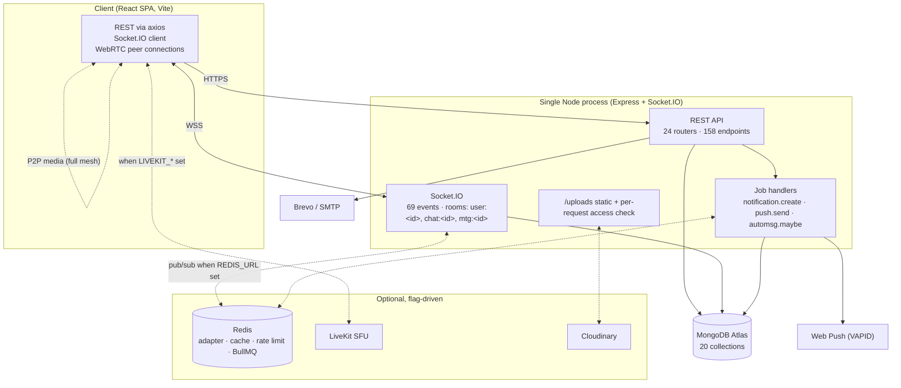
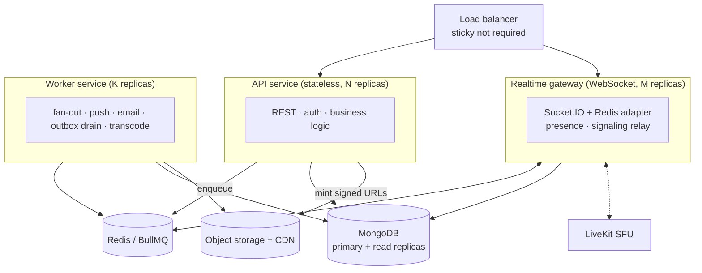
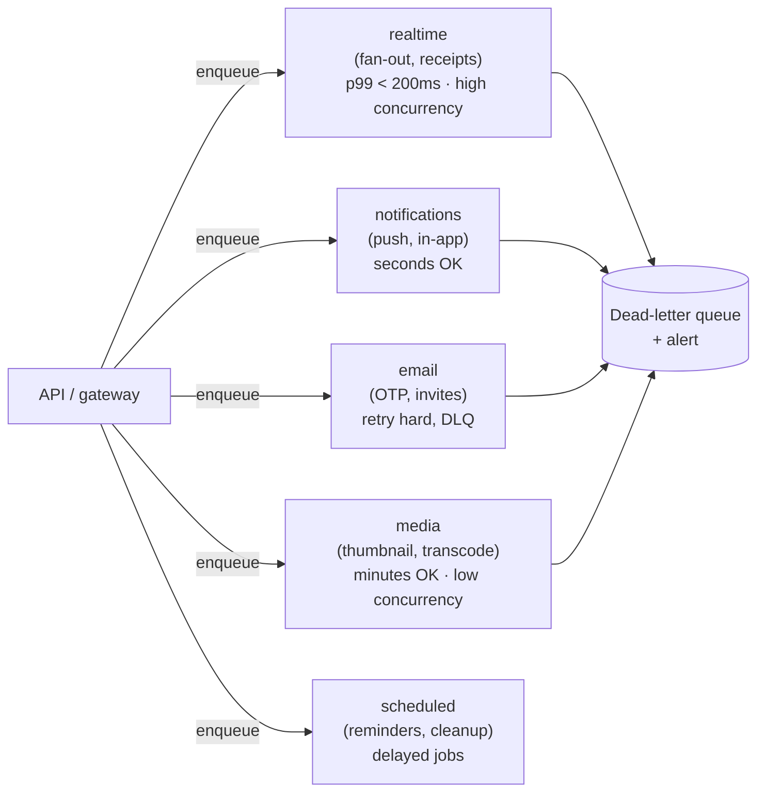

# Architecture Review

A staff-level review of the ChatKonect backend: current topology, ranked findings, a
decomposition plan, queue design, and fault-tolerance work — with the thresholds that should
*trigger* each step rather than a blanket "do all of this".

Every claim below was checked against the source. File references are clickable.

**Contents**
1. [Verdict up front](#1-verdict-up-front)
2. [What the system is today](#2-what-the-system-is-today)
3. [Findings, ranked by blast radius](#3-findings-ranked-by-blast-radius)
4. [Monolith → services](#4-monolith--services)
5. [Queue architecture](#5-queue-architecture)
6. [Fault tolerance](#6-fault-tolerance)
7. [Sequenced roadmap](#7-sequenced-roadmap)
8. [What not to do](#8-what-not-to-do)

---

## 1. Verdict up front

**This is a well-built monolith, and the most valuable architectural advice is: do not
decompose it yet.**

The scaling work that usually motivates a service split has *already been done inside the
monolith*, and done well. Setting `REDIS_URL` switches on the Socket.IO Redis adapter, a shared
rate-limit store, a cache, and a BullMQ worker — with no code duplication, because the queue
abstraction runs the identical handler inline or in a worker
([`utils/queue.js`](../server/utils/queue.js), [`utils/redis.js`](../server/utils/redis.js)).
Realtime fan-out already goes through rooms (`emitToUser` → `io.to('user:<id>')`), which means it
becomes cross-instance correct the moment the adapter attaches, with zero changes at the call
sites. That is the design decision that makes horizontal scaling possible, and it is right.

So the honest ranking of what limits this system today is:

| Rank | Limit | Nature |
|---|---|---|
| 1 | Render **free plan** — sleeps, drops WebSockets, blocks SMTP | Deployment, not architecture |
| 2 | `numInstances: 1` with `REDIS_URL` unset | Configuration |
| 3 | Correctness bugs that only appear at >1 instance (§3.1) | Small, fixable in place |
| 4 | Dual-write / no-transaction data integrity (§3.2) | Real architectural gap |
| 5 | Unbounded documents and queries (§3.3, §3.4) | Real, will bite at scale |
| 6 | Service boundaries | **Not currently a constraint** |

Splitting into services before fixing 1–5 would multiply the operational surface while leaving
every actual defect intact — and would convert in-process function calls that are currently
atomic-ish into network calls that need retries, timeouts and idempotency. The plan in §4
therefore extracts exactly three things, each because it has a genuinely *different scaling
axis*, and leaves the rest as a modular monolith.

---

## 2. What the system is today



**Facts that matter for the review**

| Property | Today |
|---|---|
| Deployable units | 1 (API + WebSocket + job worker in one process) |
| Datastore | One MongoDB Atlas cluster; no read-replica routing, no shard key strategy |
| Realtime | Socket.IO rooms; Redis adapter optional |
| Async work | BullMQ single queue `fanout`, concurrency 10, 3 attempts, exponential backoff — **or inline** |
| Media | Local disk *or* Cloudinary via `STORAGE_DRIVER`; served through the app process |
| Meeting media | WebRTC **full mesh** (~6 peers) unless LiveKit is configured |
| Transactions | **None anywhere** (verified: no `startSession` / `withTransaction`) |
| Observability | `morgan` access logs + `console`; no metrics, tracing, or error tracker |
| Idempotency | None — a retried write creates a duplicate |

---

## 3. Findings, ranked by blast radius

### 3.1 Presence snapshot is process-local — wrong the moment you scale out

**Severity: high (silent incorrectness, appears only after the thing you're scaling *for*)**

[`socket/index.js:52`](../server/socket/index.js#L52) returns local state only:

```js
export function onlineUserIds() {
  return [...onlineUsers.keys()];   // THIS instance only
}
```

and that feeds the `presence-snapshot` emitted to every client on connect. With 3 instances a
user sees roughly **a third** of the fleet as online; everyone else appears offline until they
happen to emit something.

Note the asymmetry: `isUserOnline()` at [line 38](../server/socket/index.js#L38) *is*
cross-instance correct (it falls back to `fetchSockets()` over the adapter). So the reachability
check used for calls is right, and the snapshot beside it is not — which is exactly the kind of
bug that survives a scale-up unnoticed.

**Fix:** hold presence in Redis (`SADD presence:online <userId>` with a TTL heartbeat), and make
`onlineUserIds()` read that when the adapter is attached. Keep the local `Map` as the fast path.

**Related:** `setPresence()` writes `isOnline` to the User document on every connect *and*
disconnect ([line 68](../server/socket/index.js#L68)). On mobile networks that reconnect
constantly, this is heavy write amplification on your hottest collection. Presence belongs in
Redis with a TTL; persist `lastSeen` on a debounce instead.

### 3.2 Dual writes with no transaction — the message/chat split

**Severity: high**

Sending a message is two independent writes ([`messageController.js`](../server/controllers/messageController.js)):

```js
let message = await Message.create({ … });   // write 1
…
await chat.save();                            // write 2 — lastMessage, updatedAt
```

A crash, failover or write error between them leaves a message that exists but is invisible in
the chat list (which orders by `updatedAt` and previews `lastMessage`). There is no
reconciliation path.

The same pattern is worse in account deletion ([`userController.js`](../server/controllers/userController.js)):
a `Promise.all` of `deleteMany` across eight collections, then `findByIdAndDelete(user)`. Partial
failure leaves orphans pointing at a user that no longer exists — **precisely** the class of
inconsistency that made `getStatusFeed` throw on `s.user._id` and 500 the entire feed.

**Fix:** Atlas is a replica set, so multi-document transactions are available. Wrap the
message+chat write in `withTransaction`. For cross-collection cleanup, prefer a **transactional
outbox** (§5.4) over a best-effort `Promise.all`, so the work is retried until it completes rather
than silently half-done.

### 3.3 Unbounded arrays inside documents

**Severity: high at group scale**

`Message` embeds `readBy[]`, `deliveredTo[]`, `viewedBy[]`, `starredBy[]`, `reactions[]`;
`Status` embeds `viewers[]` and `replies[]`. All grow without bound.

In a 1,000-member group, **every message** accumulates up to 1,000 `readBy` entries — each
`{ user, at }` with its own `_id` (that subdocument doesn't set `_id: false`). Consequences:

- Message documents grow toward the 16 MB ceiling and re-serialise on every receipt update.
- Every read of the message carries the whole receipt array over the wire.
- `$addToSet`/`$push` on a large array rewrites the document.

**Fix:** move receipts to their own collection (`{ messageId, userId, state, at }`, compound-indexed
and TTL'd), and keep only a *count* plus the caller's own state on the message. Same treatment for
`Status.viewers`.

### 3.4 Unbounded queries

**Severity: medium–high**

`getStatusFeed` ([`statusController.js`](../server/controllers/statusController.js)) does:

```js
const statuses = await Status.find({ user: { $in: audience } })
  .sort({ createdAt: -1 })
  .populate('user', USER_FIELDS)
  .populate('viewers.user', USER_FIELDS);
```

No `limit()`. `audience` is the caller plus **every contact**. A user with 500 contacts pulls
every live status those contacts have, *with viewers populated*, then filters for visibility in
application code. Privacy filtering after the fact is also why the whole result set has to be
loaded.

**Fix:** cap per owner (latest N), paginate the feed, and push the audience predicate into the
query where possible. `getViewers` needs pagination for the same reason.

### 3.5 Media is served by the application process

**Severity: medium (blocks statelessness)**

`/uploads` is served by the app, and every media request performs an access-control lookup against
`Message.attachments.url` (there is an index for exactly this). With `STORAGE_DRIVER=local`,
instances hold state on local disk — so they are **not** interchangeable, and Render's ephemeral
disk loses media on redeploy.

**Fix:** object storage as the only driver in production, with short-lived signed URLs and a CDN
in front. Authorise once at URL-mint time instead of on every byte range. This also removes a DB
query from the image hot path.

### 3.6 Fan-out is O(recipients) inline on the request path

**Severity: medium**

`sendMessage` loops recipients emitting `receive-message`, then `chat-updated`, then enqueues
per-recipient notification work. Fine for 1:1 and small groups; for large groups the p99 of the
send request scales with membership. The queue already exists — the socket emits just don't use it.

**Fix:** enqueue a single `message.fanout` job carrying the chat id; the worker expands membership
and emits. Keeps the request O(1).

### 3.7 Rate limiting is per-IP on authenticated routes

**Severity: medium**

`apiLimiter` is 1000 / 15 min keyed by IP. Behind carrier NAT or a corporate egress, thousands of
users share one IP and throttle each other; conversely one authenticated abuser rotating IPs is
unbounded. **Fix:** key on `req.user._id` for authenticated routes, keep IP limits for the
unauthenticated ones (login, OTP) where they belong.

### 3.8 No idempotency on writes

**Severity: medium**

A client that retries `POST /api/messages` after a timeout creates a second message. Mobile
networks make this routine. **Fix:** accept a client-generated `Idempotency-Key`, store it with a
short TTL, and return the original result on replay. This becomes *mandatory* once fan-out is
queued (at-least-once delivery means handlers must be idempotent anyway).

### 3.9 Observability gap

**Severity: medium — it's what makes every other incident slow**

There is structured-ish access logging and `console.error` in the error handler, but no metrics, no
distributed tracing, no error aggregation, and no alerting. Today, "the app feels slow" is not a
diagnosable statement.

**Fix, in order of value:** an error tracker (Sentry) → RED metrics per route and per job
(rate/errors/duration) → OpenTelemetry traces spanning request → job → DB. Add a `/readyz` distinct
from `/api/health` (§6.2).

### 3.10 Meeting media ceiling

**Severity: low today, hard ceiling when hit**

Full mesh means each participant uploads N−1 streams; ~6 is the practical ceiling. LiveKit is
integrated but off by default. This is correctly deferred — just know the ceiling is a cliff, not
a slope.

---

## 4. Monolith → services

### 4.1 The principle

Extract a service only when it has a **different scaling axis, failure domain, or release
cadence** from the rest. By that test, most of this app should stay together: chats, messages,
contacts, groups, status and meetings all share the same data and the same request shape. Splitting
them buys distributed transactions and pays nothing.

Three things *do* pass the test.

### 4.2 Target topology



**Why these three, specifically:**

| Service | Why it splits | Scaling axis |
|---|---|---|
| **Realtime gateway** | Long-lived connections vs short requests. Memory scales with *concurrent sockets*; a deploy drops every connection, so its release cadence must be independent. | Concurrent connections |
| **Worker** | Bursty, retryable, latency-insensitive. Must not compete with request handling for CPU, and must scale on queue depth. | Queue depth |
| **Media** | Bandwidth- and storage-bound, not CPU-bound. Mostly a CDN + signed URLs, plus optional transcode workers. | Bytes served |

Everything else stays one deployable — a **modular monolith** with enforced internal boundaries.

### 4.3 Getting there without a rewrite

The code is already close, because the queue and room abstractions hide the topology.

**Step 1 — make the process role-aware.** One image, a `ROLE` env var:

```js
const role = process.env.ROLE || 'all';           // all | api | gateway | worker
if (role === 'all' || role === 'api')     mountRest(app);
if (role === 'all' || role === 'gateway') attachSocket(server);
if (role === 'all' || role === 'worker')  await initQueue({ consume: true });
```

`ROLE=all` stays the default, so local dev and small deploys are unchanged. This is the whole
split: three deployments of one image, scaled independently. No new repos, no new contracts, no
distributed transactions. Do this before anything more ambitious.

**Step 2 — enforce module boundaries in-process.** Group by domain
(`modules/messaging/`, `modules/meetings/`, …), each exposing a service interface, and forbid
cross-module model imports with an ESLint boundary rule. This is what makes a *later* extraction
mechanical rather than archaeological — and it delivers most of the benefit on its own.

**Step 3 — extract only on a trigger.** Not on a calendar.

| Extract | Trigger |
|---|---|
| Realtime gateway | Socket memory or deploy-time connection drops become the top complaint; >~20k concurrent sockets |
| Worker | Queue depth p95 stays above target, or job CPU starves request latency |
| Media/transcode | Media egress dominates cost, or transcode is needed |
| Anything else | A specific measured constraint — otherwise **don't** |

### 4.4 Data

Keep one logical database and split by *access pattern* first, not by service:

- **Read replicas** for the heavy read paths (chat list, status feed, message history) via
  `readPreference=secondaryPreferred` on those queries only — they already tolerate staleness, and
  the 10s chat-list cache proves it.
- **Time-partition `messages`** before sharding. Most reads are recent; archive cold months out of
  the hot collection.
- **Shard key, when needed:** `chatId` (hashed). It matches the dominant query
  (`{chat, createdAt}`) and keeps a conversation on one shard. Avoid `createdAt` — it makes the
  newest chunk the only hot one.
- **Do not** give each service its own database yet. Cross-service joins in application code are a
  far worse problem than a shared schema with owned modules.

---

## 5. Queue architecture

### 5.1 What exists

[`utils/queue.js`](../server/utils/queue.js) is a good foundation: one BullMQ queue (`fanout`),
concurrency 10, 3 attempts, exponential backoff from 2s, `removeOnComplete: 1000` /
`removeOnFail: 5000`, and a transparent inline fallback. Handlers today
([`utils/jobs.js`](../server/utils/jobs.js)): `notification.create`, `push.send`, `automsg.maybe`.

### 5.2 What should also be async

| Work | Today | Move to queue because |
|---|---|---|
| Message fan-out to recipients | Inline loop | Request cost scales with group size (§3.6) |
| Email (OTP, invites, reset) | Inline, non-blocking with an 800ms deadline | Currently fire-and-forget with **no retry** — a transient SMTP failure loses the mail permanently |
| Meeting invitations | Fire-and-forget `sendEmail` | Same; and invites matter more than OTPs |
| Media post-processing | None | Thumbnails, duration probing, transcode |
| Account deletion cascade | Inline `Promise.all` | Long, multi-collection, must be resumable (§3.2) |
| Meeting reminders | **Never fire** — `reminderMinutes` is accepted, stored and editable, but nothing ever reads it | Delayed job; the claim pattern in `scheduledDispatcher.js` already fits |
| Read-receipt aggregation | Inline `updateMany` | Batch under load |

Email is the sharpest one. The 800ms-deadline design is deliberate and correct for *latency* — but
because it never retries, delivery is best-effort. A queue gives you both: return immediately
*and* retry with backoff.

### 5.3 Topology — split the single queue

One queue with one concurrency setting means a slow email blocks a latency-critical fan-out. Split
by latency class, and give each its own worker concurrency:



Rules worth writing down:

- **Idempotent handlers, always.** BullMQ is at-least-once. Use a deterministic `jobId`
  (e.g. `push:${messageId}:${userId}`) so a duplicate enqueue collapses.
- **Per-entity ordering** where it matters. BullMQ doesn't order across a queue; use one
  [FlowProducer](https://docs.bullmq.io/guide/flows) chain or a per-chat group key so two fan-outs
  for the same chat can't invert.
- **A real DLQ.** `removeOnFail: 5000` currently *discards* after retries with only a
  `console.warn`. Failures should land in a dead-letter queue and alert — a silently dropped push
  is invisible today.
- **Cap payloads.** Enqueue ids, not populated documents; the worker re-reads. Large payloads make
  Redis the bottleneck and go stale.
- **Backpressure.** Track queue depth; shed or degrade non-essential work (thumbnails, analytics)
  before latency-critical work suffers.

### 5.4 The outbox pattern — fixing the dual write properly

The real hazard isn't "the queue is down", it's **writing to Mongo and enqueuing as two separate
operations**. Either can succeed alone: a message saved with no notification, or a notification for
a message that was rolled back.

Write the intent *inside the same transaction as the data*, then drain it:

```mermaid
sequenceDiagram
    participant C as Client
    participant A as API
    participant M as MongoDB
    participant O as Outbox drainer
    participant Q as Queue

    C->>A: POST /api/messages
    A->>M: txn { insert message; update chat.lastMessage; insert outbox event }
    M-->>A: committed
    A-->>C: 201 (fast — no queue on this path)
    loop poll / change stream
        O->>M: claim unsent outbox events
        O->>Q: enqueue fanout job
        O->>M: mark event sent
    end
```

Now the message and the *promise* of its fan-out commit atomically. If the drainer crashes, events
stay unsent and are picked up later; if it double-sends, idempotent handlers absorb it. This single
pattern removes §3.2 and the enqueue-loss window together, and MongoDB **change streams** mean you
don't even need to poll.

---

## 6. Fault tolerance

### 6.1 Current state, fairly

Already present and correct: graceful SIGTERM/SIGINT shutdown with a 10s hard deadline;
`uncaughtException` → shutdown (right call — state is undefined after an uncaught throw);
prod fail-fast on missing Mongo; `trust proxy: 1`; helmet; CSRF origin guard; mongo-sanitize;
session registry for immediate revocation; Redis failures degrade to no-op rather than throwing.
That is a better baseline than most projects at this stage.

Worth singling out: [`utils/scheduledDispatcher.js`](../server/utils/scheduledDispatcher.js)
already solves the multi-instance scheduling problem *correctly*, and does it better than a
distributed lock would. It claims a due row with an atomic compare-and-set
(`findOneAndUpdate` flipping `pending → sending`), so two processes can never dispatch the same
row — the loser simply gets `null`. It also reclaims rows stuck in `sending` past
`CLAIM_STALE_MS`, which means a process dying mid-send doesn't strand the message, and it
re-resolves chat membership at *send* time rather than schedule time. That is the pattern the
outbox drainer in §5.4 should reuse verbatim.

Its two remaining limits are operational, not correctness: every instance runs its own
`setInterval` poll (N instances ⇒ N× polling, one row claimed per tick), and it currently lives in
the API process — so it should move to the `worker` role in the §4.3 split, where its poll interval
and concurrency can be tuned independently of request traffic.

### 6.2 Health checks: split liveness from readiness

`/api/health` reports DB and email status. If it returns non-200 while Mongo is briefly
unreachable, an orchestrator will **kill a process that is otherwise fine** — turning a dependency
blip into a restart storm.

- `/livez` → process is running. Never touches dependencies.
- `/readyz` → can serve traffic (DB reachable, queue reachable). Fails ⇒ removed from the LB, *not*
  restarted.
- Keep `/api/health` as the human-facing detail view.

### 6.3 Timeouts, retries, circuit breakers

Every outbound call needs a deadline. Missing today in places:

| Dependency | Needs |
|---|---|
| MongoDB | `serverSelectionTimeoutMS` + `maxTimeMS` on long queries so one slow query can't pin a connection |
| SMTP / Brevo | Already deadline-bounded for latency; add retry-with-backoff via the queue |
| Web Push | Per-endpoint timeout; prune `410 Gone` (already done) |
| Tenor, TURN credentials, LiveKit | Timeout + circuit breaker; a hung third party must not hang a request |

Add a **circuit breaker** on each third party: after N consecutive failures, fail fast for a cool-down
instead of queueing threads behind a dead dependency. Pair with **jittered** exponential backoff —
BullMQ's plain exponential retry will synchronise a thundering herd after an outage.

### 6.4 Graceful degradation ladder

Decide *now* what the app does when each dependency dies, so the behaviour is designed rather than
emergent:

| Dependency down | Degrade to | User-visible |
|---|---|---|
| Redis | In-memory presence/rate-limit; inline jobs; **single instance only** | Cross-instance presence wrong — must alert |
| Queue | Inline execution (already the fallback) | Slower writes |
| Object storage | Reject new uploads with a clear 503; keep serving existing | "Uploads unavailable" |
| Email provider | Queue and retry; never block signup | OTP delayed |
| Push (VAPID) | In-app notifications only | No background alerts |
| LiveKit | Fall back to WebRTC mesh | Small meetings only |
| Mongo primary | Read-only mode from replicas | Browse history, can't send |

The last row is worth building deliberately: a read-only mode is far better than a blank screen.

### 6.5 Don't lose the WebSocket on deploy

Today a deploy drops every socket. Once the gateway is separate: drain connections (stop accepting
new, emit a `server:draining` hint so clients reconnect to another instance), roll one replica at a
time, and keep the client's existing reconnect/backoff. Socket.IO already re-authenticates on
reconnect via the `auth` callback, so this is mostly orchestration.

### 6.6 Multi-instance correctness checklist

Before `numInstances > 1` — this is a gate, not a suggestion:

- [ ] `REDIS_URL` set (adapter, rate limit, cache, queue)
- [ ] `onlineUserIds()` reads shared presence (§3.1) — **currently would be wrong**
- [ ] No in-process caches that must agree across instances
- [ ] Sticky sessions **not** required (they aren't, with the adapter — verify)
- [x] Scheduled work safe against duplicate execution — **already done** by the atomic claim in
      `scheduledDispatcher.js` (§6.1). Any *new* periodic work must follow the same pattern.
- [ ] Job handlers idempotent

---

## 7. Sequenced roadmap

Ordered by value per unit of risk. Nothing here requires a rewrite.

**Now — correctness and visibility (days)**
1. Fix `onlineUserIds()` for multi-instance; move presence to Redis with a TTL heartbeat (§3.1).
2. Wrap message+chat in a transaction (§3.2).
3. Error tracking + RED metrics + `/livez` ÷ `/readyz` (§3.9, §6.2).
4. DLQ with alerting instead of silent `removeOnFail` (§5.3).
5. Per-user rate limits on authenticated routes (§3.7).

**Next — remove the ceilings (weeks)**
6. Transactional outbox for fan-out (§5.4).
7. Split queues by latency class; move email and meeting invites onto them with real retries (§5.2, §5.3).
8. Paginate the status feed and cap embedded arrays; migrate receipts to their own collection (§3.3, §3.4).
9. Object storage + signed URLs + CDN as the only production media path (§3.5).
10. Idempotency keys on writes (§3.8).

**Then — scale out (when triggered)**
11. `ROLE`-based split of one image into api / gateway / worker (§4.3), after the §6.6 checklist passes.
12. Read replicas for heavy read paths; time-partition `messages` (§4.4).
13. LiveKit on by default for meetings above the mesh ceiling (§3.10).
14. Shard on hashed `chatId` — only when a measured limit demands it (§4.4).

---

## 8. What not to do

- **Don't split into microservices per domain.** Chats/messages/contacts/groups share data and
  request shape; splitting them buys distributed transactions and sells nothing. The `ROLE` split
  gets you independent scaling without a single new network contract.
- **Don't introduce Kafka.** BullMQ on Redis is the right tool at this scale, and it's already
  integrated with a working inline fallback. Revisit only if you need multi-consumer replay or
  cross-team event streams.
- **Don't add a service mesh, Kubernetes, or gRPC** to a three-deployment system.
- **Don't shard MongoDB early.** Indexes, pagination, bounded documents and read replicas will
  carry this a very long way. Sharding with a wrong key is expensive to undo.
- **Don't build an API gateway layer** — one load balancer with path routing is enough for three
  services.
- **Don't remove the inline job fallback.** Running the whole app with no Redis is a genuinely
  valuable property for local dev and small self-hosted deployments.

---

### Appendix — how this review was produced

Read directly: `server/server.js`, `socket/index.js`, `utils/{queue,redis,jobs,cache,chatCache}.js`,
`config/db.js`, `middleware/*`, and the message/status/user/meeting controllers. Cross-checked
against [API.md](API.md) (158 endpoints), [DATABASE_MODELS.md](DATABASE_MODELS.md) (20 collections),
[SOCKET_EVENTS.md](SOCKET_EVENTS.md) (69 events) and [ENVIRONMENT.md](ENVIRONMENT.md). The
absence of transactions was verified by searching for `startSession` / `withTransaction` across the
server (no matches). Claims about deployment constraints come from `render.yaml` and the
production-readiness notes.
