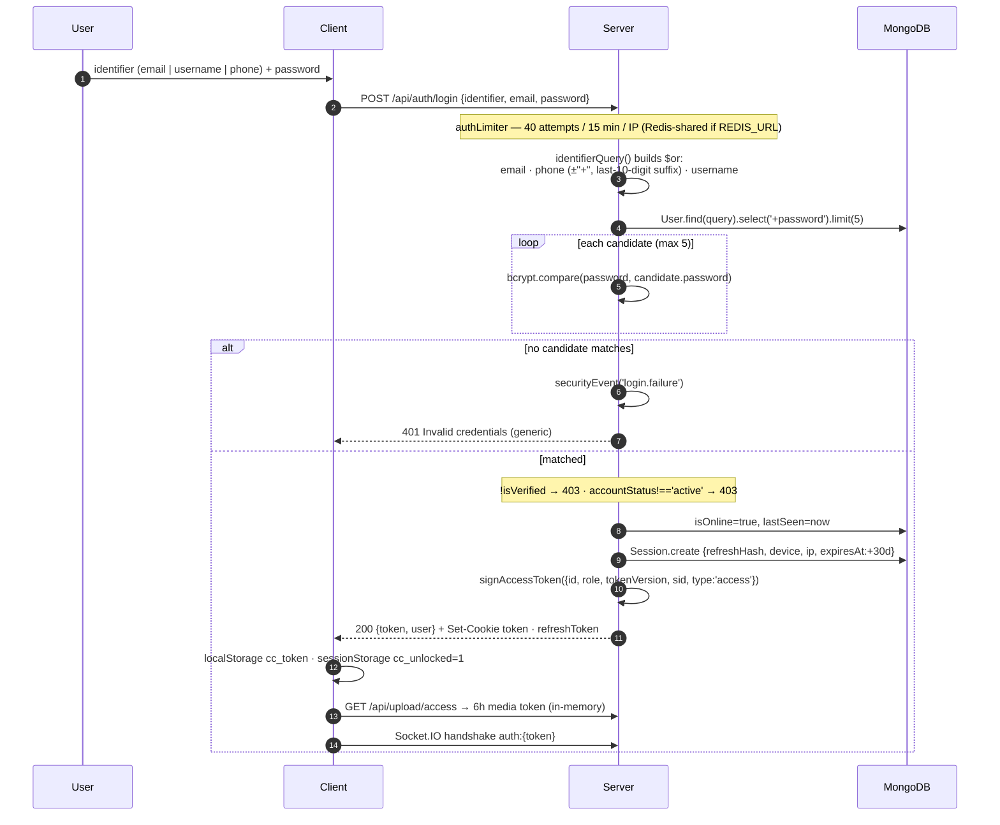
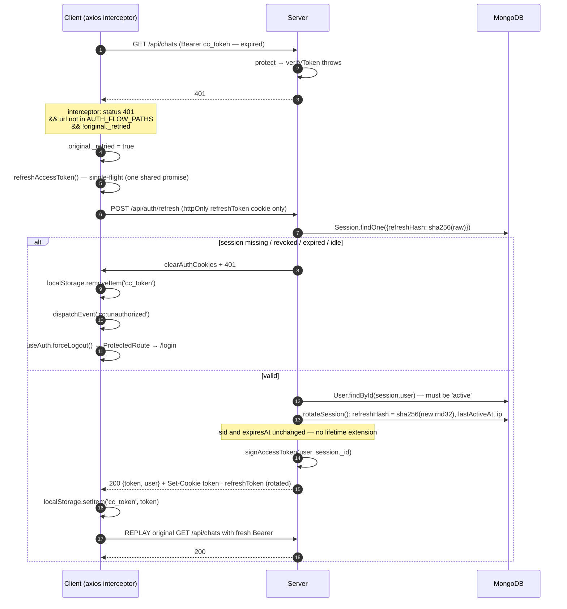

# JWT Authentication Flow

How ChatConnect authenticates browsers, sockets and third-party integrations.

**Related:** [API.md](API.md) (endpoint reference) · [ENVIRONMENT.md](ENVIRONMENT.md) (`JWT_*` vars) ·
[SOCKET_EVENTS.md](SOCKET_EVENTS.md) (handshake) · [DATABASE_MODELS.md](DATABASE_MODELS.md#session)

## 1.1 Overview

ChatConnect uses a **stateful-JWT hybrid**: short-lived HS256 access tokens that carry a session id (`sid`), backed by a `Session` collection holding an opaque, SHA-256-hashed, rotating refresh token. Every protected request re-validates the session row, so logout / device revocation / bans take effect **immediately** rather than at token expiry.

Key sources:
- `D:\office\Office Projects\whatapp clone\server\utils\token.js` — signing/verification, cookie attribute policy
- `D:\office\Office Projects\whatapp clone\server\utils\session.js` — session create/rotate/validate, cookie setting
- `D:\office\Office Projects\whatapp clone\server\middleware\auth.js` — `protect`, `adminOnly`
- `D:\office\Office Projects\whatapp clone\server\controllers\authController.js` — all auth endpoints
- `D:\office\Office Projects\whatapp clone\server\models\Session.js`
- `D:\office\Office Projects\whatapp clone\server\socket\index.js` — handshake auth (lines 131–164)
- `D:\office\Office Projects\whatapp clone\client\src\lib\api.js` — axios interceptors + single-flight refresh
- `D:\office\Office Projects\whatapp clone\client\src\store\useAuth.js` — client auth store

---

## 1.2 Token inventory

| # | Token | Signed by | Exact payload claims | TTL / expiry | Alg | Stored / transported as |
|---|-------|-----------|----------------------|--------------|-----|------------------------|
| 1 | **Access token** | `signAccessToken(user, sid)` — `server/utils/token.js:14` | `{ id, role, tokenVersion, sid, type: 'access' }` (plus `iat`, `exp`) | `JWT_ACCESS_EXPIRES`, default **`1h`** | HS256, `JWT_SECRET` | **Dual**: httpOnly cookie `token` (maxAge 1h) **and** returned in the JSON body as `token`, which the client stores in `localStorage['cc_token']` and sends as `Authorization: Bearer …` |
| 2 | **Refresh token** | *Not a JWT.* `crypto.randomBytes(32).toString('hex')` — `server/utils/session.js:13` | n/a — opaque 64-hex-char random string. Only its **SHA-256 hash** is persisted (`Session.refreshHash`, `select: false`) | `REFRESH_TOKEN_DAYS`, default **30 days** absolute (`Session.expiresAt`, backed by a Mongo TTL index) + **`SESSION_IDLE_DAYS`, default 14 days** idle cutoff | n/a (CSPRNG random, SHA-256 at rest) | **httpOnly cookie `refreshToken` only**, scoped `path=/api/auth`. Never in JS-readable storage, never in a body |
| 3 | **Media token** | `signMediaToken(userId)` — `server/utils/token.js:29` | `{ id, scope: 'media' }` | **`6h`** | HS256, `JWT_SECRET` | Not persisted. Fetched from `GET /api/upload/access`, held in a **module-level JS variable** `mediaToken` in `client/src/lib/api.js:109` (deliberately *not* localStorage), appended as `?token=…` to `/uploads/*` URLs |
| 4 | **Meeting-admission pass** | `signMeetingPass(userId, meetingId)` — `server/utils/token.js:41` | `{ id, meetingId, scope: 'meet-admit' }` | **`15m`** | HS256, `JWT_SECRET` | Emitted over the socket to an admitted guest; presented back on the next `meeting:join`. Stateless, no storage |
| 5 | **Email proof (pre-signup)** | `signEmailProof(email)` — `server/controllers/authController.js:57` | `{ email, purpose: 'signup-email' }` | **`30m`** (`EMAIL_PROOF_TTL`) | HS256, `JWT_SECRET` | Returned as `emailToken` from `POST /api/auth/email/verify-code`; the client holds it **in React state only** and echoes it in the `/auth/signup` body |
| 6 | **API key** | *Not a JWT.* `generateApiKey()` — `server/utils/apiKey.js:18` | n/a — format `cc_live_<base64url(24 random bytes)>` | **No expiry**; revoked by flipping `ApiKey.active = false` | SHA-256 at rest (`hashedKey`, `select: false`); a display-safe `prefix` (first 14 chars) is stored plaintext | Presented by the caller in the **`X-API-Key` header**. Plaintext shown to the user exactly once at creation |
| 7 | **LiveKit join token** | `createLivekitToken()` — `server/utils/livekit.js:29`, via `livekit-server-sdk` `AccessToken` | LiveKit grants: `roomJoin, room, canPublish, canSubscribe, canPublishData, roomAdmin` + `identity`, `name` | **`3h`** | Signed with `LIVEKIT_API_SECRET` (not `JWT_SECRET`) | Returned to the client for the SFU connection; not stored |
| 8 | **Password-reset token** | *Not a JWT.* `crypto.randomBytes(32).toString('hex')` — `authController.js:448` | n/a | **30 minutes** (`User.resetPasswordExpires`) | SHA-256 at rest (`User.resetPasswordToken`) | Emailed as a URL path segment: `${CLIENT_URL}/reset-password/<token>` |

### Non-token secrets (bcrypt-hashed, never transported)
- `User.password` — bcrypt **cost 12** (User pre-save hook)
- `User.twoStepPin` — bcrypt **cost 10** (`authController.js:512`)
- OTPs: signup email OTP (`EmailVerification.otp`, 10 min, 5 attempts), account OTP (`User.otp/otpExpires/otpAttempts`, 10 min, 5 attempts), PIN-reset OTP (`User.twoStepResetOtp`, 10 min, 5 attempts) — all `crypto.randomInt(100000, 1000000)` via `generateOTP()`

---

## 1.3 Cookies — exact names and flags

Base attributes come from `sessionCookieOptions()` (`server/utils/token.js:60`):

```js
{ httpOnly: true, secure: NODE_ENV === 'production',
  sameSite: NODE_ENV === 'production' ? 'none' : 'lax' }
```

| Cookie | httpOnly | secure | sameSite | path | maxAge | Set by |
|--------|----------|--------|----------|------|--------|--------|
| **`token`** (access) | `true` | `true` in prod, `false` otherwise | `none` in prod, `lax` otherwise | `/` (Express default) | `ACCESS_COOKIE_MS` = `60*60*1000` = **1 h** — hardcoded to mirror the default access TTL | `setAuthCookies()` — `server/utils/session.js:73` |
| **`refreshToken`** | `true` | same as above | same as above | **`/api/auth`** (deliberately scoped so it isn't sent on every request) | `REFRESH_TOKEN_DAYS * 86400000` = **30 days** default | `refreshCookieOptions()` / `setAuthCookies()` — `server/utils/session.js:67,74` |

**Clearing** (`clearAuthCookies()`, `session.js:77`) re-sets both to `''` with `expires: new Date(0)`, preserving the same attribute set (including `path=/api/auth` for the refresh cookie, which is required for the delete to actually match).

> ⚠️ **Known coupling bug:** `ACCESS_COOKIE_MS` is a hardcoded 1 hour. If `JWT_ACCESS_EXPIRES` is raised (e.g. `4h`), the cookie still expires after 1 h — cookie-only clients silently fall back to the refresh flow an hour in. Cross-site prod cookies also require `SameSite=None; Secure`, which is why `sameSite` is environment-switched.

---

## 1.4 What `protect` does, step by step

`server/middleware/auth.js:9-60`. Order is exact:

1. **Extract the token** — `Authorization: Bearer <t>` header first; else the `req.cookies.token` cookie. Header wins when both are present.
2. **No token → `401 "Not authenticated. Please log in."`**
3. **`verifyToken(token)`** — `jwt.verify(token, JWT_SECRET, { algorithms: ['HS256'] })`. The algorithm is **pinned**, so an attacker cannot get a token validated under `none` or an asymmetric alg confusion. Any throw → `401 "Session expired or invalid. Please log in again."`
4. **Reject scoped tokens** — `if (decoded.scope) → 401`. This blocks the media token (`scope: 'media'`) and the meeting pass (`scope: 'meet-admit'`) from ever functioning as a full API session, which matters because the media token is designed to sit in URLs.
5. **Require `sid`** — `if (!decoded.sid) → 401`. Legacy stateless tokens without a session id are rejected outright.
6. **Two parallel lookups** (`Promise.all`, explicitly to halve per-request auth latency since neither derives from the other):
   - `User.findById(decoded.id)`
   - `Session.findById(decoded.sid).select('user revokedAt expiresAt lastActiveAt')`
7. **User checks** — missing user → `401 "User no longer exists."`; `accountStatus === 'banned'` → `403`; `accountStatus === 'suspended'` → `403`.
8. **✅ tokenVersion check** — `if ((decoded.tokenVersion || 0) !== (user.tokenVersion || 0)) → 401 "Session has been revoked."` A password change or reset increments `User.tokenVersion`, which invalidates **every** token minted before it — including copies sitting in `localStorage` on other devices. Note it is a **strict inequality**, not `<`, so it also rejects tokens claiming a *higher* version.
9. **✅ Session (`sid`) validation against the `Session` collection** — `isSessionValid(session)` requires all of: session exists, `revokedAt == null`, `expiresAt > now`, and `now - lastActiveAt <= SESSION_IDLE_DAYS`. **Plus** `String(session.user) === String(user._id)` — an explicit cross-binding check, so a valid `sid` belonging to a *different* user cannot be pasted into another user's token. Failure → `401 "Session expired or revoked."`
10. **Throttled last-active bump** — if `lastActiveAt` is older than 5 minutes, fire an un-awaited `Session.updateOne({ lastActiveAt: now })` with `.catch(() => {})`. Avoids a DB write on every single request while still driving idle expiry.
11. **Attach** `req.sessionId = String(session._id)` and `req.user = user` (a full Mongoose doc), then `next()`.

`adminOnly` (line 63) then defers to `can(req.user, PERMISSIONS.PLATFORM_ADMIN)` — no hardcoded role string.

**Two independent revocation levers, by design:**
- `tokenVersion` — *global*, coarse: kills every token for the user at once (password change).
- `Session.revokedAt` — *per-device*, fine: kills one login.

---

## 1.5 Signup flow (3 endpoints, in order)

The email is proven **before the account row exists** — there are no unverified `User` documents in the database at all.

| # | Endpoint | Body | Returns | Guard |
|---|----------|------|---------|-------|
| 1 | `POST /api/auth/email/send-code` | `{ email }` | `{ success, message, devOtp? }` | `authLimiter` (40 / 15 min) |
| 2 | `POST /api/auth/email/verify-code` | `{ email, otp }` | `{ success, verified: true, emailToken }` | `authLimiter` |
| 3 | `POST /api/auth/signup` | `{ name, email, password, phone, emailToken, confirmPassword?, accountType?, inviteCode?/invite?, workspaceName?, avatar?, username? }` | **`201`** `{ success, token, user }` + sets both cookies | `authLimiter` |

### Step 1 — `sendSignupEmailCode` (`authController.js:75`)
- Normalizes email (trim + lowercase); rejects non-`/^\S+@\S+\.\S+$/` with `400`.
- **`409` if `User.exists({ email })`** — note this makes signup an *email-enumeration oracle*, unlike `forgotPassword` which deliberately does not leak.
- Upserts `EmailVerification { email, otp, expires: now+10min, attempts: 0, verifiedAt: null }`.
- Sends via `sendEmailWithin()` (bounded wait — catches a *fast* SMTP rejection; a merely slow relay finishes in the background rather than holding the request open).
- Error mapping: SMTP configured but rejected → **`502`** with an actionable message classified by `classifySendError()` into `auth` (fix `EMAIL_USER`/`EMAIL_PASS`) / `connection` (unreachable) / generic. No mailer + `NODE_ENV=production` → **`503`**.
- **Dev only** (`!emailConfigured && NODE_ENV !== 'production'`): the OTP is returned in the response as `devOtp`.

### Step 2 — `verifySignupEmailCode` (`authController.js:130`)
- Loads `EmailVerification` with `.select('+otp')`; no record / no otp → `400 "Click Verify first."`
- **`attempts >= 5` → `429`** (checked *before* comparison; a new code resets it).
- Wrong OTP → increment `attempts`, save, `securityEvent('signup.email.failure')`, `400`.
- Expired → `400`.
- On success: `verifiedAt = now`, **`otp = undefined`** (single-use), and returns `emailToken = signEmailProof(email)` — a 30-minute HS256 JWT `{ email, purpose: 'signup-email' }`.

> Ordering note: the attempts/match checks run *before* the expiry check, so a correct-but-expired code returns "expired" while a wrong one returns "invalid" — no expiry-vs-validity oracle either way.

### Step 3 — `signup` (`authController.js:154`)
1. **Explicit allowlist destructure** — only `{ name, email, password }` are read positionally. `role`, `isAdmin`, `admin`, `accountStatus`, `isVerified` from the body are **never** read: mass-assignment privilege escalation is structurally impossible. `role: 'user'` is hardcoded in `baseDoc`.
2. Validation: all three present and strings; email regex; **password ≥ 8 chars**; `confirmPassword` matched *only if* it's a string (so API clients may omit it).
3. `409` if the email exists.
4. **Phone is required and unique** — `normalizePhone()` (7–15 digits); `400` if invalid, `409` if taken. One number = one account.
5. **Email proof gate** — `if (EMAIL_VERIFY_ON && !emailProofValid(req.body.emailToken, email.trim().toLowerCase()))` → `400`. `emailProofValid` verifies the signature **and** that `purpose === 'signup-email'` **and** that the `email` claim equals the submitted email — so a proof for one address can't be replayed for another. When `ENABLE_EMAIL_VERIFICATION !== 'true'` this whole step is skipped.
6. **Workspace resolution** — the invite code is validated *before* the account is created so a bad code fails cleanly. `accountType` defaults to **`'personal'`** (an invite, or an explicit `'workspace'`, selects `'workspace'`). The comment is explicit that defaulting to `workspace` would strand API/legacy clients alone in a private tenant.
7. **Username auto-derivation** — `generateUsername()` slugifies the email local part, pads to ≥3 chars, then appends 4 random digits until free (bounded at 8 tries, then a base36 timestamp). Wrapped in a retry loop that catches the `E11000` unique-index race between two simultaneous signups (`err.keyValue.username`, up to 2 retries).
8. `isVerified: true`; avatar = `safeAvatar()` (a ≤400 KB base64 png/jpeg/webp data-URL **or** an ≤2048-char https URL — anything else is silently dropped so signup never fails over a photo) or a generated DiceBear URL.
9. Attach to workspace: `joinWorkspaceByCode` / `joinPersonalSpace` / `createWorkspaceForUser`.
10. Delete the `EmailVerification` record (fire-and-forget), log `signup.success`, then `sendTokenResponse(req, res, user, 201)`.

### `sendTokenResponse` — the single login-establishment path (`session.js:87`)
```
createSession(user, req)        → Session row + plaintext refresh token
signAccessToken(user, sid)     → 1h HS256 access JWT bound to that session
setAuthCookies(res, a, r)      → httpOnly `token` + `refreshToken`
res.status(code).json({ success, token, user: user.toSafeJSON(), ...extra })
```
`createSession` records `device` (from `parseDevice(User-Agent)` — a dependency-free OS/browser label), `userAgent` (truncated to 300 chars), `ip` (correct because `app.set('trust proxy', 1)`), `lastActiveAt`, and `expiresAt = now + 30d`.

```mermaid
sequenceDiagram
    autonumber
    participant U as User
    participant C as Client (useAuth / api.js)
    participant S as Server (authRoutes)
    participant DB as MongoDB
    participant M as Mailer (Brevo/SMTP)

    U->>C: enters email, clicks "Verify"
    C->>S: POST /api/auth/email/send-code {email}
    S->>DB: User.exists({email})?
    alt already registered
        S-->>C: 409 account exists
    else free
        S->>DB: upsert EmailVerification {otp, expires:+10m, attempts:0}
        S->>M: sendEmailWithin(OTP)
        M-->>S: sent | pending | failed
        S-->>C: 200 {message, devOtp? (dev only)}
    end

    U->>C: types the 6-digit code
    C->>S: POST /api/auth/email/verify-code {email, otp}
    S->>DB: find EmailVerification .select('+otp')
    Note over S: attempts>=5 → 429; mismatch → ++attempts, 400; expired → 400
    S->>DB: verifiedAt=now, otp=undefined (single use)
    S-->>C: 200 {verified:true, emailToken}  %% HS256 {email, purpose:'signup-email'} 30m

    U->>C: name, password, phone → Submit
    C->>S: POST /api/auth/signup {name,email,password,phone,emailToken,...}
    Note over S: allowlist body (no role/isAdmin) · pwd>=8 · phone unique<br/>emailProofValid(sig + purpose + email match)
    S->>DB: User.create (bcrypt cost 12, role:'user', isVerified:true)
    S->>DB: join workspace / personal space
    S->>DB: Session.create {refreshHash: sha256(rnd32), expiresAt:+30d}
    S-->>C: 201 {token, user} + Set-Cookie token(1h) + refreshToken(30d, /api/auth)
    C->>C: localStorage cc_token · sessionStorage cc_unlocked=1 · ensureMediaToken(true)
```

---

## 1.6 Login flow and identifier resolution

**`POST /api/auth/login`** — `{ identifier | email, password }` → `200 { success, token, user }` + both cookies. Guarded by `authLimiter`.

`login` (`authController.js:359`) reads `req.body.identifier ?? req.body.email` (legacy clients send `email`; the client actually sends **both** keys with the same value — `useAuth.js:40`).

### `identifierQuery(identifier)` — `authController.js:307`
Builds a Mongo `$or` from whichever forms the input could plausibly be:

1. **Email** — if the string contains `@`: `{ email: id.toLowerCase() }`
2. **Phone** — if `normalizePhone(id)` succeeds, strip a leading `+` to get `digits` and add:
   - `{ phone: { $in: [digits, '+' + digits] } }` — stored phones vary in format
   - if `digits.length >= 10`, also `{ phone: new RegExp(`${digits.slice(-10)}$`) }` — a **suffix match on the last 10 digits**, so a user who omits their country code still finds their account
3. **Username** — if it matches `/^[a-z0-9_.]{3,30}$/i`: `{ username: id.toLowerCase() }`

Returns `null` if nothing matched → `400`.

### `checkCredentials` — `authController.js:327`
Because a phone identifier can legitimately match **multiple** rows, this is deliberately a *multi-candidate* check:

```js
const candidates = await User.find(query).select('+password').limit(5);
for (const candidate of candidates)
  if (await candidate.matchPassword(password)) { user = candidate; break; }
```

**The password disambiguates which account was meant** — a bcrypt compare, so a suffix collision can never authenticate the wrong user. Capped at 5 candidates to bound the bcrypt cost (5 × cost-12 ≈ a few hundred ms worst case). Then:

- No match → `securityEvent('login.failure', { identifier: sliced to 60 chars })` → **`401` "Invalid credentials"** (generic — no distinction between unknown identifier and wrong password)
- `EMAIL_VERIFY_ON && !user.isVerified` → `403`
- `accountStatus !== 'active'` → `403 "Your account is <suspended|banned>."`

On success: set `isOnline = true`, `lastSeen = now`, save with `validateBeforeSave: false`, log `login.success`, `sendTokenResponse`.

> ⚠️ The `$or` regex arm (`new RegExp(digits.slice(-10) + '$')`) is an unanchored suffix regex against an indexed field — it forces a collection/index scan on the phone index. Fine at current scale; worth an eye at high user counts.



---

## 1.7 Refresh / rotation flow

**`POST /api/auth/refresh`** — `router.post('/refresh', authLimiter, refresh)` (`authRoutes.js:39`).

**Deliberately NOT behind `protect`** — by the time you need to refresh, the access token has already expired, so `protect` would reject you. The **httpOnly `refreshToken` cookie is the sole authenticator.**

`refresh` (`authController.js:386`):

1. `raw = req.cookies?.refreshToken`; missing → `401 "No refresh token."`
2. `Session.findOne({ refreshHash: hashToken(raw) })` — **lookup by SHA-256 hash**; the plaintext is never stored, so a DB dump yields no usable refresh tokens.
3. `!isSessionValid(session)` → `clearAuthCookies(res)` then `401`. Clearing on failure stops the client from re-looping on a dead cookie.
4. `User.findById(session.user)`; missing or `accountStatus !== 'active'` → **revoke the session** (`revokedAt = now`), clear cookies, `401 "Account is not active."` — a ban takes effect at refresh time even if the user is mid-session.
5. **`rotateSession(session, req)`** — mints a *new* random refresh token, overwrites `refreshHash` (**the old refresh token is instantly dead — single-use rotation**), sets `lastActiveAt = now`, updates `ip`.
6. **`signAccessToken(user, session._id)`** — a fresh 1 h access token bound to the **same** `sid`.
7. `setAuthCookies(res, accessToken, refreshToken)` → `res.json({ success, token, user: user.toSafeJSON() })`.

### What rotates vs. what persists

| | Rotates on refresh | Persists |
|---|---|---|
| Refresh token value / `refreshHash` | ✅ every call | |
| Access token (new `iat`/`exp`, refreshed `role`/`tokenVersion`) | ✅ | |
| `lastActiveAt`, `ip` | ✅ | |
| **`sid` / `Session._id`** | | ✅ stable for the login's whole life |
| **`Session.expiresAt`** | | ✅ absolute 30-day cap is **never extended** |
| `device`, `userAgent`, `createdAt` | | ✅ |

So a session dies at the earlier of: 30 days absolute, 14 days idle, or explicit revocation. Refresh cannot extend a session indefinitely.

> Note: rotation is **not** reuse-detecting. Replaying a stolen old refresh token yields a clean `401` (its hash no longer matches) but does **not** revoke the session as a breach signal — a standard hardening step that isn't implemented here.



---

## 1.8 Logout and session revocation

| Action | Endpoint | Mechanism |
|--------|----------|-----------|
| **Log out this device** | `POST /api/auth/logout` (`protect`) | Prefers `Session.updateOne({ refreshHash: hashToken(req.cookies.refreshToken) }, { revokedAt: now })`; **falls back** to `{ _id: req.sessionId }` when there's no refresh cookie (header-only/mobile clients). Then `clearAuthCookies()`, sets `isOnline = false` + `lastSeen = now`. This is a real server-side revocation, not just a cookie wipe. |
| **List devices** | `GET /api/auth/sessions` (`protect`) | `{ user, revokedAt: null, expiresAt: { $gt: now } }` sorted by `lastActiveAt` desc → `{ id, device, ip, lastActiveAt, createdAt, current }`, where `current` compares against `req.sessionId`. |
| **Revoke one device** | `DELETE /api/auth/sessions/:id` (`protect`) | `Session.updateOne({ _id: req.params.id, user: req.user._id }, { revokedAt })`. **The `user` clause is the authorization** — you cannot revoke a stranger's session by guessing an id. Idempotent, always `200` (no existence oracle). |
| **Log out all other devices** | `POST /api/auth/sessions/revoke-others` (`protect`) | `Session.updateMany({ user, _id: { $ne: req.sessionId }, revokedAt: null }, { revokedAt })` — current session survives. |
| **Password change** | `PATCH /api/auth/change-password` (`protect`) | Verifies `currentPassword`; then **`tokenVersion += 1`** *and* `Session.updateMany({ user, revokedAt: null }, { revokedAt })` — **both** levers. Then `sendTokenResponse(…, 200, { message: 'Password updated.' })` mints a brand-new session for the current device. Net effect: every other device is logged out, this one stays in. |
| **Password reset** | `POST /api/auth/reset-password/:token` | Same pattern: `tokenVersion += 1`, revoke all sessions, then a fresh session for the resetting device. Token looked up by SHA-256 hash with `resetPasswordExpires: { $gt: Date.now() }`. |
| **Ban / suspend** | (admin) | `protect` `403`s on the next request; the socket middleware rejects the next handshake; `refresh` revokes the session outright. |
| **Idle / absolute expiry** | passive | `isSessionValid()` on every request + a Mongo TTL index on `expiresAt` that physically removes the row. |

Belt-and-braces: after a password change an old access token fails **twice over** — `tokenVersion` mismatch (step 8) *and* a revoked session (step 9).

---

## 1.9 How the client attaches credentials and auto-refreshes

`D:\office\Office Projects\whatapp clone\client\src\lib\api.js`

**Instance** — `axios.create({ baseURL: resolveApiBase(), withCredentials: true })`. `withCredentials: true` is what makes the httpOnly cookies travel cross-origin.

**Request interceptor** (line 34) — reads `localStorage['cc_token']` on **every** request and sets `Authorization: Bearer …` if present. Reading fresh each time (rather than closing over a value) means a refresh elsewhere is picked up immediately.

**Dual-credential design:** cookies are the primary, XSS-resistant channel; the `Bearer` header from `localStorage` is a fallback for cross-site setups where third-party-cookie blocking (Safari ITP, Chrome's phase-out) kills `SameSite=None` cookies. Cost: the access token is XSS-readable. The refresh token never is, and the media token is kept in a module variable specifically to stay out of `localStorage`.

**Response interceptor** (line 65) — refresh-and-replay:

```js
if (status === 401 && !AUTH_FLOW_PATHS.test(url) && !original._retried) {
  original._retried = true;
  const token = await refreshAccessToken();
  if (token) {
    original.headers = { ...(original.headers||{}), Authorization: `Bearer ${token}` };
    return api(original);              // transparent replay
  }
  localStorage.removeItem('cc_token');
  window.dispatchEvent(new Event('cc:unauthorized'));
}
const message = err.response?.data?.message || err.message || 'Something went wrong';
return Promise.reject(new Error(message));
```

Three guards, each load-bearing:

1. **`AUTH_FLOW_PATHS`** — `/\/auth\/(login|signup|email\/(send|verify)-code|verify-otp|resend-otp|forgot-password|reset-password|change-password|refresh)/`. On these routes a 401 means *"wrong credentials"*, not *"token expired"*. Without this, a mistyped password would trigger a refresh attempt and, on failure, force-log-out a user who was never logged in. Including `refresh` itself prevents infinite recursion.
2. **`original._retried`** — a per-request flag; at most one refresh+replay per request.
3. **Single-flight `refreshAccessToken()`** (line 48) — a module-level `refreshing` promise. When the token expires, *many* in-flight requests 401 simultaneously; all of them `await` **one** `/auth/refresh` call instead of stampeding it. Critical here because refresh **rotates** the token: N concurrent refreshes would rotate N times, and all but the last would be handed an already-invalidated refresh token. `.finally()` clears the latch; `.catch(() => null)` makes failure a `null` return rather than a throw.

**Terminal failure** → remove `cc_token`, dispatch a `cc:unauthorized` DOM event. `useAuth.js:257` listens and calls `forceLogout()` (clears `cc_token`, `cc_demo_authed`, `cc_unlocked`, media token, resets appearance, `user: null`) and `ProtectedRoute` redirects to `/login`. **A DOM event is used specifically to avoid a circular `api ⇄ store` import.**

All errors are normalized to `new Error(server message || axios message || 'Something went wrong')`, so UI code can `catch (e) { toast(e.message) }` uniformly.

**Client-side storage summary:**

| Key | Store | Contents |
|-----|-------|----------|
| `cc_token` | `localStorage` | Access JWT |
| `cc_demo_authed` | `localStorage` | Demo-mode flag |
| `cc_unlocked` | `sessionStorage` | App-lock PIN satisfied for this tab session |
| `mediaToken` | JS module variable | 6 h media token (never persisted) |
| `token`, `refreshToken` | httpOnly cookies | Not JS-readable |

**Boot** — `useAuth.init()` short-circuits to logged-out if there's no `cc_token`, else `GET /auth/me`; on failure it drops the token and clears state.

> ⚠️ Because `init()` gates on `localStorage['cc_token']`, a user whose access token was cleared but who still holds a **valid `refreshToken` cookie** is shown the login screen instead of being silently restored. A cookie-only client is never bootstrapped.

---

## 1.10 Socket.IO handshake authentication

`D:\office\Office Projects\whatapp clone\server\socket\index.js:131-164` — an `io.use()` middleware that mirrors `protect` almost check-for-check.

**Server side:**
1. Token from `socket.handshake.auth.token`, else `socket.handshake.headers.authorization?.split(' ')[1]`.
2. Missing → `next(new Error('No auth token'))`.
3. `verifyToken(token)` — HS256 pinned; any throw → `Error('Invalid auth token')`.
4. **`if (decoded.scope) → Error('Invalid auth token')`** — the media token can't open a socket.
5. `User.findById(decoded.id).select('accountStatus tokenVersion privacy name avatar email')` — a narrow projection since this runs per connection. Missing → error; `accountStatus !== 'active'` → `Error('Account is not active')`.
6. **`tokenVersion` mismatch → `Error('Session revoked')`.**
7. **`if (!decoded.sid) → Error('Invalid session')`**, then `Session.findById(decoded.sid)` and `if (!isSessionValid(session) || String(session.user) !== String(user._id)) → Error('Session revoked')` — the same user-binding check as `protect`.
8. Stash on the socket: `socket.userId`, `userName`, `userAvatar`, `userEmail`, and `socket.readReceipts = user.privacy?.readReceipts !== false`.

On `connection`, the same values are **also** copied to `socket.data.*` — deliberately, so they survive `adapter.fetchSockets()` across instances when building a meeting roster. The socket joins its personal room `user:<userId>`.

**Two authorization notes worth flagging:**
- **All listeners are registered synchronously first**, before any `await`. Clients emit `join-chat` the instant they connect; any `await` before registration would drop those early events.
- **`join-chat` verifies membership** (`isChatMember`) before joining `chat:<id>`. Because a socket is only ever in that room after verification, **room membership itself doubles as the authorization check** for typing/reaction/read-receipt relays (`inChat()`), so a non-member can't inject events. Socket payloads bypass Express's `mongoSanitize`, so every id used in a query is validated through `isId()` (`mongoose.isValidObjectId`) — otherwise a client could send `{ chatId: { $ne: null } }` and turn a scoped update into a collection-wide one.

**Client side** (`client/src/hooks/useSocket.js:76`):
```js
io(url, {
  auth: (cb) => cb({ token: localStorage.getItem('cc_token') }),   // callback form!
  withCredentials: true,
  transports: ['websocket', 'polling'],
})
```
- **`auth` as a callback, not an object** — it is re-invoked on *every* reconnect, so the socket picks up a refreshed token automatically without being torn down and recreated.
- `connect_error` handler: `refreshAccessToken()` once (guarded by a `refreshedForAuth` flag to prevent a refresh loop) then `socket.connect()`.
- `connect` handler skips the *first* connect but on every **re**connect re-emits `join-chat` for the active chat and calls `useChat.resync()` — server-side rooms are gone after a drop, and events emitted while offline were missed.
- The socket is keyed on `user?._id`, **not** the whole user object — a profile edit replaces the object and would otherwise tear down the socket, dropping an in-progress call's signaling channel.

---

## 1.11 RBAC

`D:\office\Office Projects\whatapp clone\server\utils\rbac.js` — the single source of truth. Controllers/routes ask via `can()` / `workspaceCan()` / `groupCan()` / `authorize()` rather than hardcoding `role === '…'`.

### Three independent role dimensions

| Dimension | Field | Values |
|-----------|-------|--------|
| **Platform** | `User.role` | `'user'` \| `'admin'` (default `'user'`) — `admin` = super-admin |
| **Workspace** | `User.workspaceRole` | `'owner'` \| `'admin'` \| `'member'` (default `'member'`) |
| **Group (per chat)** | `Chat.participants[].role` | `'owner'` \| `'admin'` \| `'member'` |

Also `User.accountStatus`: `'active'` \| `'suspended'` \| `'banned'` (default `'active'`).

### Permission matrix

| Permission | Constant | Platform `admin` | WS `owner` | WS `admin` | WS `member` |
|---|---|:---:|:---:|:---:|:---:|
| `platform:admin` | `PLATFORM_ADMIN` | ✅ | ❌ | ❌ | ❌ |
| `workspace:settings` | `WORKSPACE_SETTINGS` | ✅ | ✅ | ✅ | ❌ |
| `workspace:invite` | `WORKSPACE_INVITE` | ✅ | ✅ | ✅ | ❌ |
| `workspace:transfer` | `WORKSPACE_TRANSFER` | ✅ | ✅ | ❌ | ❌ |
| `members:read` | `MEMBERS_READ` | ✅ | ✅ | ✅ | ✅ |
| `members:manage` | `MEMBERS_MANAGE` | ✅ | ✅ | ✅ | ❌ |

| Group permission | Constant | Group `owner` | Group `admin` | Group `member` |
|---|---|:---:|:---:|:---:|
| `group:manage` | `GROUP_MANAGE` | ✅ | ✅ | ❌ |
| `group:members` | `GROUP_MEMBERS` | ✅ | ✅ | ❌ |
| `group:post` | `GROUP_POST` | ✅ | ✅ | ✅ |

### Evaluation semantics
```js
export function can(user, permission) {
  if (!user) return false;
  if (user.role === 'admin') return true;                 // platform super-admin override
  if (permission === PERMISSIONS.PLATFORM_ADMIN) return false;
  return (WORKSPACE_ROLE_PERMISSIONS[user.workspaceRole] || []).includes(permission);
}
```
- Platform `admin` short-circuits to **true for everything**.
- `platform:admin` is then explicitly unreachable for non-admins — a workspace owner is *not* a platform admin. The ordering matters: without the second line, an unknown-permission lookup could otherwise fall through the workspace table.
- Unknown `workspaceRole` → `[]` → deny (fail-closed).
- `groupCan(role, permission)` is a pure lookup — group roles are **orthogonal**: platform admin does *not* short-circuit group permissions, so an admin can't post to a group they aren't in.
- `authorize(permission)` is the route middleware form; `adminOnly` is `authorize(PLATFORM_ADMIN)` in spirit. **Both must be used after `protect`** (they read `req.user`).
- `signAccessToken` embeds `role` in the JWT, but the token comment and `protect` both make clear that **authorization always re-reads the role from the DB**, so a stale `role` claim grants nothing.

### API-key scopes (a separate axis)
`server/utils/apiKey.js` — `API_SCOPES = ['chat:read','chat:write','contacts:read','calls:write','meetings:read','meetings:write']`. `apiKeyAuth([...scopes])` sets `req.user = key.owner`, so **a key can never reach data its owner couldn't** — the existing controllers apply unchanged. Requires *all* listed scopes (`403` naming the missing one), rejects inactive keys and non-`active` owners, and stamps `lastUsedAt` best-effort. Rate limit: `apiV1Limiter` = **120 req/min keyed on the `X-API-Key` header** (falling back to IP).

---

## 1.12 Two-step verification (app-lock PIN)

A **4–8 digit** PIN, bcrypt-hashed at cost 10, that gates opening the app on a device. It sits **behind** login — every endpoint is `protect`ed — so it is a local/at-rest protection, not a second authentication factor for the API.

| Endpoint | Middleware | Body | Behaviour |
|----------|-----------|------|-----------|
| `POST /api/auth/two-step/enable` | `protect` | `{ pin }` | `400` unless `/^\d{4,8}$/`. **`400` if already enabled** — never silently overwrite an existing PIN. Sets `twoStepPin = bcrypt.hash(pin, 10)`, `twoStepEnabled = true`. |
| `POST /api/auth/two-step/change` | `protect`, `authLimiter` | `{ currentPin, newPin }` | Requires `twoStepEnabled`; `bcrypt.compare(currentPin)` must pass; `newPin` must validate **and differ** from the current. Rate-limited because it's a guessing surface. |
| `POST /api/auth/two-step/disable` | `protect` | `{ pin }` | If enabled, the PIN must match; then `twoStepEnabled = false`, `twoStepPin = undefined`. |
| `POST /api/auth/two-step/verify` | `protect`, `authLimiter` | `{ pin }` | If not enabled, returns `{ verified: true }` (no-op). Else `bcrypt.compare` → `{ verified: true }` or `400 "Incorrect PIN."` |
| `POST /api/auth/two-step/forgot` | `protect`, `authLimiter` | — | Emails a 6-digit OTP (`twoStepResetOtp`, 10 min, `twoStepResetAttempts = 0`). Returns `{ message, email, devOtp? }`. The requester is already authenticated, so the OTP simply proves email ownership. |
| `POST /api/auth/two-step/reset` | `protect`, `authLimiter` | `{ otp, pin }` | Same 5-attempt cap as signup OTPs. Validates the new PIN, checks attempts → OTP match → expiry, then sets the new hash and clears the OTP fields. Locked chats stay locked and open with the **new** PIN. |

`twoStepPin`, `twoStepResetOtp`, `twoStepResetExpires`, `twoStepResetAttempts` are all `select: false` and explicitly `.select('+…')`-ed. Every branch emits a `securityEvent`.

**Client:** `App.jsx:39` reads `sessionStorage['cc_unlocked'] === '1'` to decide whether to render the lock screen. Anything that proves identity sets the flag — `login`, `signup`, `verifyOtp`, `enableTwoStep`, `verifyTwoStep`, `resetTwoStepPin` — and `logout` / `forceLogout` remove it. Using **`sessionStorage`** (not `localStorage`) means the lock re-arms in every new tab/window.

> ⚠️ **Design limitation, worth stating plainly:** the gate is client-side. `cc_unlocked` is attacker-writable from the console, and no API endpoint requires PIN satisfaction — a valid access token alone reaches all data. This is app-lock UX (à la WhatsApp's screen lock), not an authorization boundary.

---

## 1.13 Cross-cutting request-path controls

`D:\office\Office Projects\whatapp clone\server\server.js`

- **`app.set('trust proxy', 1)`** — required behind Render/Vercel/NGINX for correct `req.ip` (rate-limit keys, `Session.ip`) and `Secure` cookie handling.
- **Middleware order:** `helmet({ crossOriginResourcePolicy: 'cross-origin' })` → `compression()` → `cors({ origin: corsOrigin, credentials: true })` → `express.json({ limit: '2mb' })` → `urlencoded` → `cookieParser()` → `mongoSanitize` → `morgan` (`combined` in prod, `dev` otherwise).
- **`/uploads/:filename` is NOT `express.static`** — it routes to `serveUpload`, which requires a token and, for chat attachments, membership of the owning chat; status media must pass `assertAudience`; avatars are readable by any authenticated user. **A token in the query string must have `scope === 'media'`** (`mediaController.js:44`), so the session JWT can never be laundered through a URL. Path traversal is stripped via `path.basename` plus a `filePath.startsWith(uploadDir)` re-check. Response: `Cache-Control: private, max-age=3600` — `private`, never `public`, so a shared CDN/proxy can't store an access-controlled file and replay it to someone else.
- **API mount:** `app.use('/api', apiLimiter, csrfGuard, apiRoutes)`.

### CSRF (`server/middleware/csrf.js`)
Origin-verification, not tokens. Safe methods (`GET`/`HEAD`/`OPTIONS`) pass. For mutations, `req.get('origin') || req.get('referer')` must be in the allowlist, else `403 "Cross-site request blocked."` A **missing** Origin/Referer is allowed — that means a non-browser client (curl, tests, API-key integrations) which carries no ambient session cookie to abuse.

`isAllowedOrigin()` is the **single allowlist shared by CORS and CSRF**, so the two can't drift: `CLIENT_URL` (default `http://localhost:5290`) + `EXTRA_CORS_ORIGINS` always; plus any `localhost` / `127.0.0.1` / dotted-quad LAN origin **only when `NODE_ENV !== 'production'`**. A `Referer` URL is normalized down to its origin via `new URL(origin).origin`.

`corsOrigin()` in `server.js:36` deliberately calls `cb(null, false)` rather than throwing on a disallowed origin — throwing returns a 500 and makes CSRF defense an implicit side-effect of CORS. Declining CORS headers means the browser can't read the response, while `csrfGuard` remains the explicit gate that returns a clean 403.

### Rate limits (`server/middleware/rateLimit.js`)
All use a **shared Redis store when `REDIS_URL` is set** (so a fleet enforces one combined limit and limits survive redeploys), falling back to the per-process `MemoryStore` otherwise.

| Limiter | Window | Max | Key |
|---|---|---|---|
| `apiLimiter` (all `/api`) | 15 min | 1000 | IP |
| `authLimiter` (auth + two-step) | 15 min | 40 | IP |
| `webhookIngressLimiter` (`POST /api/hooks/:token`) | 60 s | 30 | **`req.params.token`** |
| `apiV1Limiter` (public API) | 60 s | 120 | `X-API-Key` header |

The webhook limiter keys on the *token* by explicit design: webhook ingress is unauthenticated (the token **is** the credential), so a leaked token replayed from many IPs would never share an IP bucket, while legitimate high-volume callers (CI, monitoring) can share a NAT with unrelated traffic. Keying on the token caps abuse of one webhook without punishing a whole network.

### Boot-time env validation (`validateEnv()`, `server.js:50`)
- `JWT_SECRET` shorter than 32 chars **or** equal to the example placeholder → **`process.exit(1)` in production**, warning otherwise.
- `NODE_ENV !== 'production'` → loud warning that CORS is permissive, cookies aren't `Secure`, and dev OTPs may be returned in responses.
- `ENABLE_EMAIL_VERIFICATION=true` with no mail transport → error in prod, warning in dev. Checked via `isEmailConfigured()` so the `SMTP_*` aliases and `BREVO_API_KEY` count.
- `MONGO_URI` missing → `process.exit(1)` in production (`config/db.js:13`); boots without a DB in dev.

---

