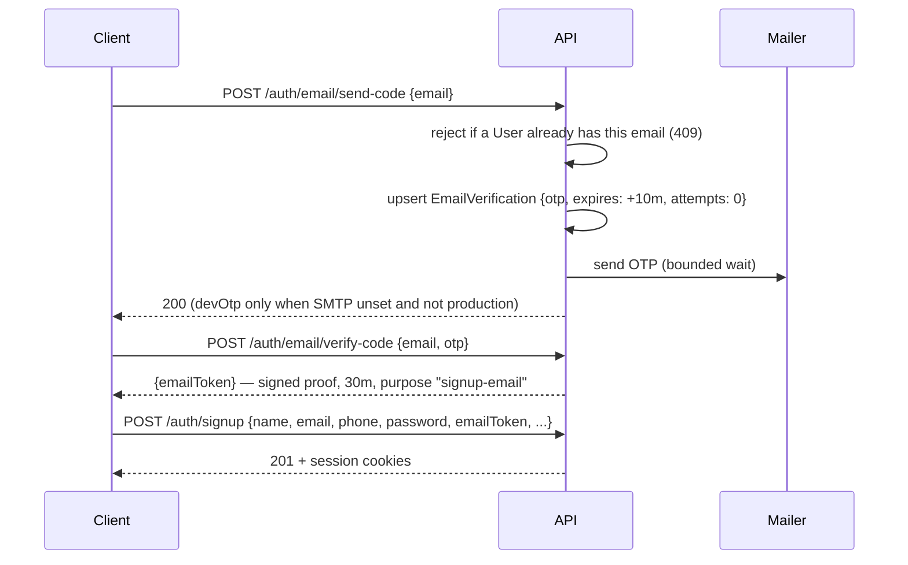
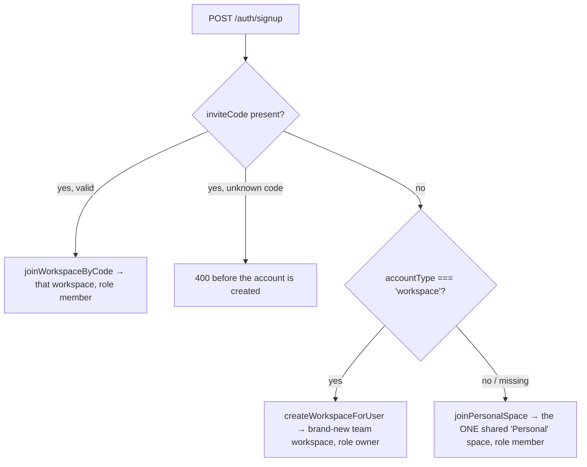
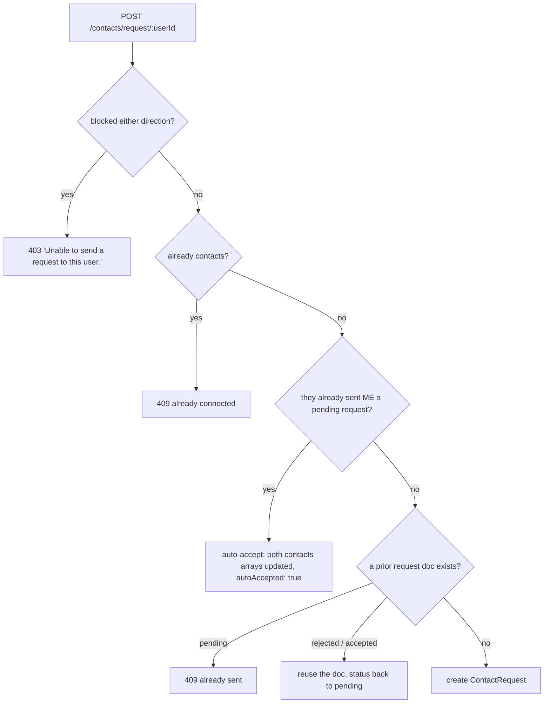
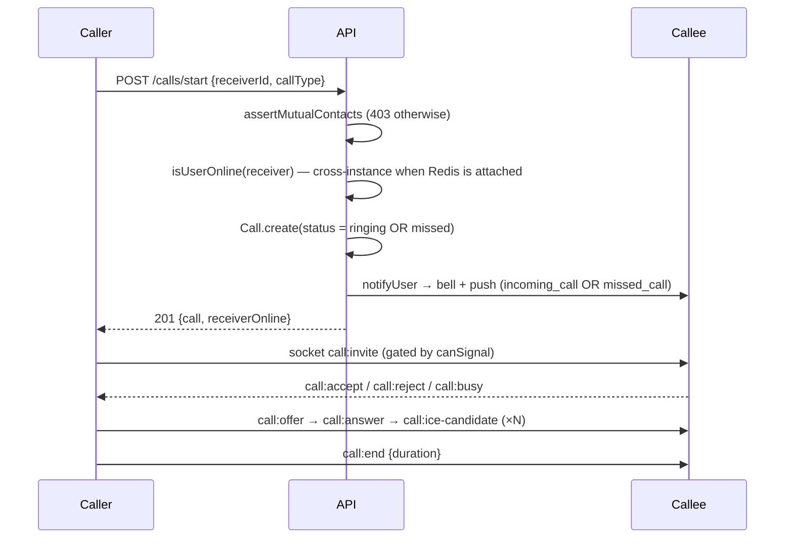
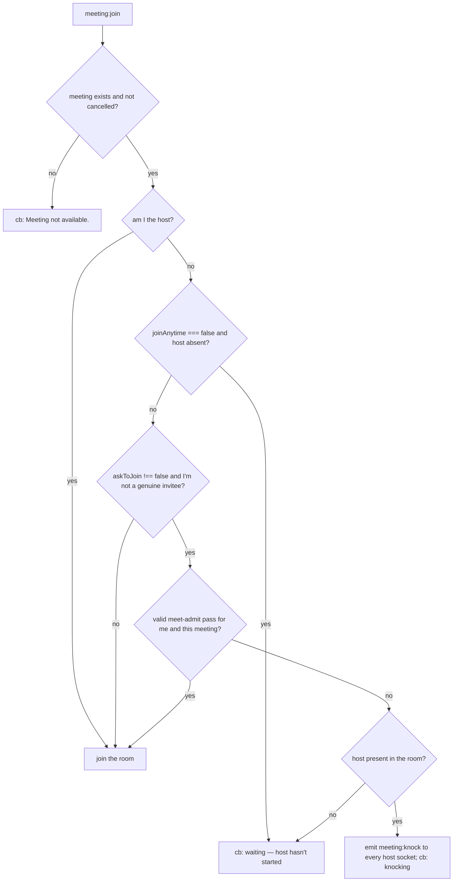
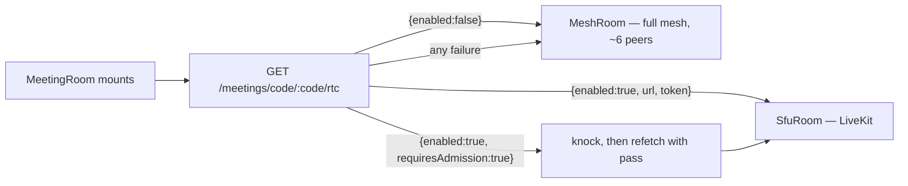
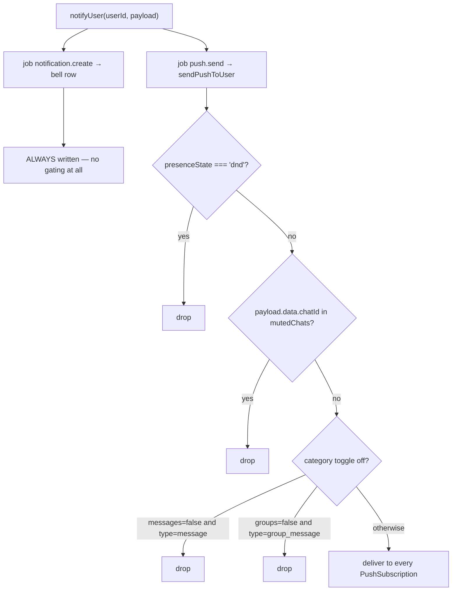
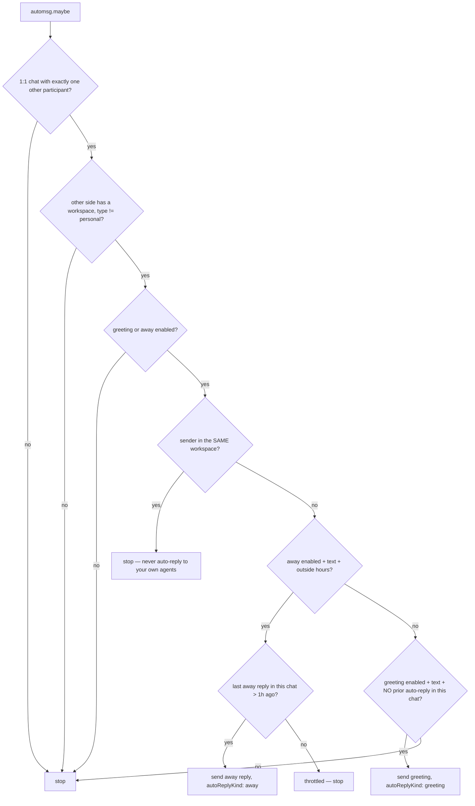

# Feature Flow & Business Logic

**How to read this.** This document explains *how the product behaves and why* — the rules,
decision points, side effects and failure modes behind each feature. It is not an endpoint
list: for request/response shapes see [API.md](API.md), for the realtime event catalogue see
[SOCKET_EVENTS.md](SOCKET_EVENTS.md), for schema fields see
[DATABASE_MODELS.md](DATABASE_MODELS.md), and for configuration see
[ENVIRONMENT.md](ENVIRONMENT.md).

Every rule and number below was read out of the code (`server/controllers/*`, `server/utils/*`,
`server/socket/index.js`, `server/models/*`, and the client hooks/stores where the behaviour
lives in the browser). Where a rule is enforced only on the client, or only on the server, that
is stated explicitly — it matters. Where the code contains a gap or a contradiction, it is
recorded in [§15 Known gaps](#15-known-gaps-and-contradictions) rather than smoothed over.

Each flow follows the same shape:

> **Trigger** → **Sequence** (numbered) → **Rules & validations** → **Side effects** (socket
> events, notifications, cache invalidation, DB writes) → **Edge cases & failure modes**

---

## Table of contents

- [0. Building blocks you need first](#0-building-blocks-you-need-first)
- [1. Account creation & onboarding](#1-account-creation--onboarding)
- [2. Contact discovery & contact requests](#2-contact-discovery--contact-requests)
- [3. 1:1 messaging lifecycle](#3-11-messaging-lifecycle)
- [4. Group chats](#4-group-chats)
- [5. Special message types](#5-special-message-types)
- [6. Voice & video calls](#6-voice--video-calls)
- [7. Meetings](#7-meetings)
- [8. Status / stories](#8-status--stories)
- [9. Notifications](#9-notifications)
- [10. Business & workspace features](#10-business--workspace-features)
- [11. Communities](#11-communities)
- [12. Privacy & safety](#12-privacy--safety)
- [13. Multi-tenancy](#13-multi-tenancy)
- [14. Scaling & background work](#14-scaling--background-work)
- [15. Known gaps and contradictions](#15-known-gaps-and-contradictions)
- [16. Reference: every hard-coded number](#16-reference-every-hard-coded-number)

---

## 0. Building blocks you need first

Four mechanisms recur in every flow below. Read these once and the rest of the document gets
much shorter.

### 0.1 Identity, sessions and the request gate

`middleware/auth.js#protect` runs on nearly every route and does five things on **every**
request:

1. Reads the access JWT from `Authorization: Bearer` **or** the `token` httpOnly cookie.
2. Rejects any token carrying a `scope` claim — scoped tokens (media, meeting-admission) can
   never act as a session.
3. Requires a `sid` claim and loads `User` + `Session` **in parallel**.
4. Rejects `accountStatus` `banned` (403) / `suspended` (403), and rejects a token whose
   `tokenVersion` no longer matches the user's (401) — this is how password changes, bans and
   workspace suspensions kill live tokens instantly.
5. Validates the tracked session (not revoked, inside absolute expiry, not idle-expired) and
   bumps `lastActiveAt` at most once every **5 minutes**.

| Token / session | TTL | Notes |
|---|---|---|
| Access token | `JWT_ACCESS_EXPIRES`, default **1h** | Carries `id`, `role`, `tokenVersion`, `sid` |
| Refresh token | `REFRESH_TOKEN_DAYS`, default **30 days** | Stored only as SHA-256 hash; rotated on every refresh; cookie scoped to `/api/auth` |
| Idle timeout | `SESSION_IDLE_DAYS`, default **14 days** | A session untouched for this long is dead even if not expired |
| Media token | **6h**, `scope: 'media'` | Safe to put in `` URLs |
| Meeting admission pass | **15m**, `scope: 'meet-admit'` | Issued by the host on admit |

Authorization decisions never trust the JWT's `role` claim — the role is re-read from the DB
each request, so a stale claim grants nothing.

### 0.2 Socket rooms

| Room | Joined when | Used for |
|---|---|---|
| `user:<userId>` | Automatically on connect | Per-user fan-out (`emitToUser`) — messages, calls, invites |
| `chat:<chatId>` | On `join-chat`, **only after membership is verified** | Typing, receipts, reactions, pins (`emitToChat`) |
| `mtg:<meetingId>` | On `meeting:join`, after the admission gate | Meeting mesh signalling, in-meeting chat, hand-raise |

Because a socket is only ever *in* `chat:<id>` after membership was verified, room membership
doubles as a free authorization check for relays: a non-member cannot inject typing or read
events into a chat.

Message fan-out deliberately targets **personal rooms**, not the chat room, so a recipient who
does not have that conversation open still receives the message instantly (this is what drives
delivered ticks and the notification bell).

### 0.3 `notifyUser` — one call, two side effects

`utils/notify.js#notifyUser(userId, {...})` enqueues **two** jobs and returns immediately:

- `notification.create` → persists a `Notification` row (the in-app bell). **Never gated** by
  any preference.
- `push.send` → `sendPushToUser`, which *is* gated (see [§9](#9-notifications)).

Both run off the request path. See [§14](#14-scaling--background-work) for queue vs inline.

### 0.4 The chat-list cache

`GET /api/chats` is the hottest endpoint in the app, so it is a read-through Redis cache
(`utils/chatCache.js`) with a **10-second** TTL. The TTL is a safety net, not the correctness
mechanism: every write that can change a chat's ordering, preview, unread count or per-user
flags calls `invalidateChatListCache(userIds)`. With no `REDIS_URL` every cache call is a
silent no-op and the endpoint simply queries Mongo.

Unread counts for the whole list are computed in **one** aggregation (`sender != me`,
`isDeleted: false`, `readBy.user != me`, `deletedFor != me`), not one query per chat.

---

## 1. Account creation & onboarding

### 1.1 Email must be verified *before* the account exists

**Trigger:** the user presses **Verify** on the signup form.



**Sequence**

1. `POST /auth/email/send-code` validates the address shape and **409s if an account already
   exists** for it.
2. A CSPRNG 6-digit OTP is upserted into `EmailVerification` with a **10-minute** expiry and
   `attempts: 0`. One live record per email address; the collection has a TTL index that purges
   rows **1 hour after last update**.
3. The send is awaited only long enough to catch a *fast* rejection. A slow relay finishes in
   the background rather than holding the request open.
4. `POST /auth/email/verify-code` compares the code. **5 wrong guesses** locks that code (429 —
   request a new one). On success the OTP is cleared, `verifiedAt` stamped, and a JWT
   `{email, purpose: 'signup-email'}` with a **30-minute** TTL is returned as `emailToken`.
5. `POST /auth/signup` requires that proof (when `ENABLE_EMAIL_VERIFICATION=true`) and creates
   the account with `isVerified: true`. The `EmailVerification` row is then deleted.

**Rules & validations**

| Rule | Detail |
|---|---|
| Mass-assignment safety | Signup reads only `name`, `email`, `password`, `phone`, `avatar`, `username`, `inviteCode`/`invite`, `accountType`, `workspaceName`. `role` is hard-coded to `'user'` — admins only exist via seed or manual promotion. |
| Password | Minimum **8** characters; bcrypt cost **12** in a `pre('save')` hook. `confirmPassword`, if present, must match. |
| Phone | **Required and unique.** Normalised (optional `+` then 7–15 digits) and enforced by a partial unique index (empty phones never collide). |
| Email | Must be unique; lower-cased. |
| Avatar (optional) | A base64 `image/png|jpeg|webp` data URL up to **400,000** characters, or an `https` URL up to **2048** characters. Anything else is **silently ignored** — signup never fails over a photo. |
| Fallback avatar | `https://api.dicebear.com/9.x/glass/svg?seed=<username>` |

**Username auto-generation.** Signup no longer asks for a username. `generateUsername()`:

1. Honours an explicit `username` only if it matches `^[a-z0-9_.]{3,30}$` (legacy clients).
2. Otherwise takes the email local part, strips anything outside `[a-z0-9_.]`, truncates to
   **24** characters, and pads short bases (`"ab"` → `"abuser"`).
3. Probes up to **8** candidates, appending a random 4-digit suffix on each collision.
4. Final fallback: base (18 chars) + `Date.now().toString(36)`.
5. The `User.create` itself is retried up to **3 times** on an `E11000` username race between
   two simultaneous signups.

### 1.2 Which workspace does a new user land in?



- The invite code is validated **before** the user document is created, so a bad code fails
  cleanly with no orphan account.
- **The effective default is `personal`.** The code is
  `inviteCode || req.body.accountType === 'workspace' ? 'workspace' : 'personal'`, so any client
  that omits `accountType` (older clients, API consumers, tests) lands in the shared Personal
  space. This is deliberate: a user alone in a private workspace could never reach anybody.
  A company workspace is explicit opt-in. (A stale comment in `authController.js` still calls
  `'workspace'` the default — see [§15](#15-known-gaps-and-contradictions).)
- `joinPersonalSpace` is a get-or-create on the fixed slug `personal-space`, race-safe on the
  unique index. Its `owner` field is nominal — the shared space has no real owner or admin.
- `createWorkspaceForUser` reserves a unique slug (up to 6 attempts, then a base36 timestamp
  suffix) and a unique invite code, and sets `workspaceRole: 'owner'`, `plan: 'free'`.

### 1.3 Global reachability — the deliberate design decision

A workspace is an **organisational** layer, not a hard contact wall:

- Anyone can be **found by exact** email, username or phone number, across every workspace.
- **Partial** name/username/email search is scoped to the caller's own team workspace only —
  a company directory, never a browsable global directory of every user.
- Contact requests, 1:1 chats and calls may cross workspace boundaries.
- Groups, meeting pre-invites and workspace member management stay inside one tenant.

See [§13](#13-multi-tenancy) for exactly where scoping is and is not applied.

### 1.4 Login

**Trigger:** `POST /auth/login {identifier | email, password}`.

1. `identifierQuery()` builds an `$or` over email (if it contains `@`), phone (with and without
   `+`, plus a "last 10 digits" regex so a missing country code still matches) and username.
2. Up to **5** candidate users are fetched and bcrypt-compared in turn; the password is what
   disambiguates a phone suffix overlap.
3. Unverified accounts are rejected (403) when `ENABLE_EMAIL_VERIFICATION=true`; non-`active`
   accounts are rejected with `Your account is <status>.`
4. `isOnline: true` and `lastSeen` are written, then `sendTokenResponse` creates a `Session`
   (device label parsed from the User-Agent), mints an access token bound to it, and sets both
   cookies.

**Side effects.** `securityEvent('login.success' | 'login.failure', …)` audit lines; auth routes
are rate-limited to **40 requests / 15 minutes** per IP.

**Edge cases.** OAuth-style accounts without a local password: `matchPassword` resolves `false`
instead of throwing, so the candidate loop continues rather than aborting. `POST /auth/refresh`
is deliberately **not** behind `protect` (the access token may already be dead) — it
authenticates with the refresh cookie, rotates it, and revokes the session if the account is no
longer active.

**Password change / reset** both bump `tokenVersion` **and** revoke every tracked session, then
issue a fresh session for the current device. A forgotten-password request always returns
success, so the endpoint cannot be used to enumerate registered emails; the reset link is valid
**30 minutes**.

---

## 2. Contact discovery & contact requests

### 2.1 Search

**Trigger:** `GET /api/users/search?q=`.

1. Empty query → empty list, no DB hit.
2. The `$or` always contains **exact** `email` and `username` matches; if `normalizePhone(q)`
   succeeds, exact phone matches with and without `+` are added.
3. If the caller's workspace is **not** the shared Personal space, a fourth clause adds
   case-insensitive **partial** regex matching on `email`/`username`/`name` *within that
   workspace only*. The query string is regex-escaped (no ReDoS).
4. The caller and everyone on the caller's `blockedUsers` list are excluded; results are capped
   at **20**.
5. Every result passes through `applyPresencePrivacy(user, viewerIsContact)`.

`applyPresencePrivacy` is the single place presence and identifier privacy is enforced:

| Field | Hidden when |
|---|---|
| `isOnline` | `privacy.onlineStatus` is `nobody`, or is `contacts` and the viewer is not a contact |
| `lastSeen` | same rule with `privacy.lastSeen` |
| `phone`, `email` | **the viewer is not a contact** — unconditionally |
| `privacy`, `contacts` | always stripped before serialisation |

That identifier gate is the counterweight to global reachability: you can find someone by an
identifier you already know, but search can never be used to *harvest* phone numbers or emails
from usernames.

### 2.2 Requesting, accepting, rejecting

Contacts are **consent-based**. Nothing in the product adds a contact unilaterally — that would
bypass both the chat gate and status privacy.



**Rules**

- Blocks are honoured **in both directions**.
- A previously **rejected** request does not permanently block re-sending: the stale document is
  reused and flipped back to `pending`, which also keeps the `{from, to}` unique index from
  producing a 500.
- Accepting writes `$addToSet` on **both** users' `contacts` arrays — the relationship is always
  symmetric.
- `PATCH /contacts/request/:id` requires that the caller is the `to` party and the request is
  still `pending`.
- Rejecting is silent: no socket event, no notification to the sender.

**Side effects**

| Event | Emitted to | Also |
|---|---|---|
| `contact-request` | requestee's personal room | `notifyUser` → bell + push (`type: 'contact_request'`, `url: /contacts`) |
| `contact-accepted` | requester's personal room | `notifyUser` → bell + push |

The client additionally shows a toast and reloads the contacts store, so requests appear without
a refresh.

### 2.3 What being a contact unlocks

| Capability | Requires |
|---|---|
| Opening a **new** 1:1 chat | **Mutual** contacts (both `contacts` arrays contain the other) |
| Starting a 1:1 call | Mutual contacts (`assertMutualContacts`) |
| WebRTC signalling to a peer | Mutual contacts, *or* shared group membership, *or* shared live call record |
| Seeing someone's `phone` / `email` | Being their contact |
| Seeing `isOnline` / `lastSeen` when set to `contacts` | Being their contact |
| Appearing in someone's status feed | Being their contact (**always**, even for audience `everyone`) |
| Being added to a broadcast list | Mutual contacts |
| Being added to a group when `groupAddPermission: 'contacts'` | Being the adder's contact |

### 2.4 Blocking — what it actually does

`POST /api/users/me/block/:id` is a **toggle** on the caller's `blockedUsers`. Its enforced
effects are exactly two:

1. Blocked users are excluded from the caller's search results.
2. Contact requests are refused in **both** directions.

It does **not** stop messages, calls or status views inside an already-established
relationship — nothing else in the server reads `blockedUsers` except the workspace-removal and
account-deletion scrubbers. See [§15](#15-known-gaps-and-contradictions).

---

## 3. 1:1 messaging lifecycle

### 3.1 Opening a conversation

`POST /api/chats/direct/:userId` is get-or-create:

1. An existing non-group chat with **exactly two** participants including both users is reused.
2. Only if none exists is the **mutual-contact gate** applied — checking both directions, so a
   one-sided add cannot open a chat.
3. `workspace` is set to the caller's workspace only when both users share it. A **cross-tenant
   DM is created with `workspace: null` on purpose**, so it is never swept up by
   workspace member-removal.
4. Both parties' chat-list caches are invalidated (the chat is new for both).

### 3.2 Sending

**Trigger:** `POST /api/messages`.

```mermaid
sequenceDiagram
    participant S as Sender
    participant API
    participant DB as MongoDB
    participant Q as Queue
    participant R as Recipients
    S->>API: POST /messages {chatId, content, type, ...}
    API->>DB: assertMember(chatId) — 403/404 if not a participant
    API->>API: messagingPolicy check (groups only)
    API->>API: validate type / content / attachments
    API->>DB: Message.create (deliveredTo + readBy pre-seeded with sender)
    API->>DB: chat.lastMessage = message._id; chat.save()
    API->>API: invalidateChatListCache(all participants)
    API->>R: emitToUser(each participant, 'receive-message')
    API->>R: emitToUser(each other participant, 'chat-updated')
    API->>Q: notifyUser(each other participant) → bell + push
    API->>Q: enqueue('automsg.maybe') for 1:1 chats
    API-->>S: 201 {message}
```

**Rules & validations**

| Rule | Value |
|---|---|
| Client-settable types | `text`, `image`, `video`, `audio`, `voice`, `document`, `location`. `poll`, `product` and `system` are server-generated only. |
| Text length | ≤ **10,000** characters |
| Attachments | ≤ **20** per message; each URL must start `/uploads/` or `https://`. Anything else (`data:`, `javascript:`, relative paths) is **dropped silently**. |
| Mentions | Array truncated to **100** ids |
| Emptiness | Rejected unless there is content, at least one attachment, or a location |
| Group posting | If `isGroup && messagingPolicy === 'admins'`, the sender's per-chat role must hold `GROUP_MANAGE` |
| Disappearing | If `chat.disappearingSeconds > 0`, `expiresAt = now + seconds` |
| View-once | Honoured **only** for `image` and `video` |

**Side effects.** As in the diagram. Note the two deliberate design points:

- The message is delivered to every participant's **personal** room, not the chat room, so
  online users get it instantly even with the chat closed.
- `deliveredTo` and `readBy` are pre-seeded with the sender, which keeps the sender's own
  messages out of their own unread count for free.

The push/bell body is `content.slice(0, 120)` or `"Sent <type>"`; group notifications are
titled with the group name and prefixed `"<sender>: "`.

### 3.3 Delivered vs read

Two distinct concepts, two distinct transports:

| Concept | Trigger | Server write | Broadcast |
|---|---|---|---|
| **Delivered** (grey ✓✓) | Recipient's client emits `message:delivered {chatId, messageId}` on receiving it | `$addToSet deliveredTo` — only if `sender != me` and not already present | `message:status {status: 'delivered'}` to the chat room, **only if a document was actually modified** |
| **Read** (coloured ✓✓) | Recipient emits `message:read {chatId}` when viewing, or calls `POST /api/messages/read` | `$push readBy` for every unread message from others in that chat | `message:read {chatId, userId}` — **suppressed if the reader disabled read receipts** |

Read-receipt privacy is *reciprocal and server-enforced in two places*: the socket handshake
caches `socket.readReceipts = user.privacy.readReceipts !== false`, and the REST `markRead`
re-checks `req.user.privacy?.readReceipts`. Reads are still recorded server-side either way, so
the user's own unread counts stay correct — the sender simply is never told.

The client marks a chat read only when it is the active chat **and** `document.visibilityState
=== 'visible'`; otherwise it pushes the message into the notification bell instead.

### 3.4 Unread counting and chat-list ordering

- Chats are sorted by `updatedAt` descending — and `updatedAt` moves because `chat.save()` runs
  on every send to set `lastMessage`.
- `unreadCount` per chat comes from the single aggregation described in [§0.4](#04-the-chat-list-cache).
- `pinned` / `archived` / `muted` are **per-user** arrays on the `User` document
  (`pinnedChats`, `archivedChats`, `mutedChats`), surfaced onto each chat object so they persist
  across devices. `POST /api/users/me/chats/:chatId/:action` toggles them.
- Locked chats are **excluded** from `GET /api/chats` entirely and only appear via
  `POST /api/chats/locked` after the PIN.

### 3.5 Editing and deleting — the real windows

| Operation | Window | Who | On expiry |
|---|---|---|---|
| Edit (`PATCH /messages/:id`) | **5 minutes** (`EDIT_WINDOW_MS = 5 * 60 * 1000`) | Sender only | 403 `"Messages can only be edited within 5 minutes of sending."` |
| Delete for everyone (`DELETE /messages/:id?scope=everyone`) | **5 minutes** (`DELETE_EVERYONE_WINDOW_MS = 5 * 60 * 1000`) | Sender only | 403 — "Delete for yourself instead." |
| Delete for me (`?scope=me`, the default) | Unlimited | Any participant | n/a |

- An edit re-validates the **same 10,000-character cap** as a send, so an edit cannot balloon a
  message past the send-time limit.
- Edits set `isEdited: true` + `editedAt` and broadcast `message-edited` to the chat room.
- Delete-for-everyone sets `isDeleted: true` and **clears `content` and `attachments`** (a
  tombstone, not a hidden row), then broadcasts `message-deleted`.
- Delete-for-me only `$addToSet`s the caller into `deletedFor`; every read path filters
  `deletedFor: { $ne: me }`.
- `DELETE /api/chats/:id/clear` is the bulk form of delete-for-me across a whole conversation.
- `DELETE /api/chats/:id` behaves differently by type: for a **group** it removes the caller
  (deleting the chat if they were the last participant); for a **1:1** it only marks every
  message `deletedFor` the caller — the other side keeps the conversation.

### 3.6 Reading history and searching

`GET /api/messages/:chatId?before=&limit=` — membership-gated, `limit` default **40**, hard cap
**100**, newest-first internally then reversed for the client. `GET /api/messages/:chatId/search?q=`
is a regex-escaped case-insensitive content search, capped at **50**, excluding deleted messages.

---

## 4. Group chats

A group is a `Chat` with `isGroup: true` — the same collection as 1:1 chats. There is no separate
Group or GroupMember model.

### 4.1 Roles and the group RBAC matrix

`participant.role` is per-chat: `owner` | `admin` | `member`.

| Permission | owner | admin | member |
|---|:--:|:--:|:--:|
| `GROUP_MANAGE` — rename, description, avatar, `messagingPolicy` | ✅ | ✅ | ❌ |
| `GROUP_MEMBERS` — add / remove / change role | ✅ | ✅ | ❌ |
| `GROUP_POST` — send messages | ✅ | ✅ | ✅ |

Checks go through `utils/rbac.js#groupCan(role, permission)`; `groupController.requireGroupPerm`
defaults to `GROUP_MANAGE`, which is the historic "admin" gate.

### 4.2 Creation

**Trigger:** `POST /api/groups {name, description, avatar, members[]}`.

1. `name` is required; `members` must be an array.
2. Member ids are de-duplicated and the creator is removed from the list.
3. Candidates go through `resolveInvitees` — the **same** gate as
   [§4.3 Add members](#43-adding-removing-leaving): tenant boundary, the invitee's
   `groupAddPermission`, and blocks. Rejections are returned in `skipped`, not swallowed.
4. Participants are `[{creator, role: 'owner'}, ...others as 'member']`. `workspace` is the
   creator's **only if every member shares it**, otherwise `null` — a workspace tag means "all
   members belong to it", which is what workspace member-removal relies on (§11).
5. A fallback avatar `https://api.dicebear.com/9.x/shapes/svg?seed=<name>` is generated.
6. A `pre('save')` hook mints an `inviteCode`: **10 characters** from a 32-character
   ambiguity-free alphabet, using `crypto.randomInt` (not `Math.random`), so codes cannot be
   predicted from one another.
7. A `system` message `"<name> created “<group>”"` (`systemEvent: 'group_created'`) is created
   and becomes `lastMessage`.
8. Every participant's chat-list cache is invalidated, **then** `chat-updated` is emitted to their
   personal room. Order matters: the client refetches within ~400ms of that event, and against a
   live cache it would otherwise be served the pre-group list and never see the new chat.

### 4.3 Adding, removing, leaving

**Add members** (`POST /api/groups/:id/members`) — admin-gated. It shares one resolver with group
creation (`resolveInvitees`), so both entry points apply the same two gates:

1. The embedded-**tenant** boundary (`tenantScope`) — never crossed.
2. Each invitee's own `privacy.groupAddPermission`: `'contacts'` means only their own contacts may
   pull them in; `'everyone'` (the default) allows anyone. A block in either direction also stops
   the add, so `'everyone'` can't be used to route around one.

There is deliberately **no workspace filter** — group membership follows the same global
reachability as contacts, DMs and calls. (It used to have one, and because it was applied silently,
picking cross-workspace contacts produced a group containing only its creator while the API still
returned 201.) Everyone who can't be added comes back in `skipped` with a reason
(`privacy` / `blocked` / `not_found`) for the caller to surface.

A `member_added` system message names everyone actually added; every participant's chat-list cache
is invalidated, then `chat-updated` goes to each new member and `group-updated` (with the populated
chat) to the room.

**Remove member** (`DELETE /api/groups/:id/members/:userId`) — admin-gated, and the **owner can
never be removed** (400). Emits a `member_removed` system message, `chat-updated` to the removed
user, `group-updated` to the room.

**Change role** (`PATCH /api/groups/:id/members/:userId/role`) — admin-gated; `role` must be
`admin` or `member`; the **owner's role can never be changed** (400). There is no "promote to
owner" for groups — ownership only moves when the owner leaves. Promotion is what lets anyone
other than the owner manage the group: an `admin` holds `GROUP_MEMBERS`, so they can add and
remove members. Every participant's chat-list cache is invalidated, since roles travel on
`participants[].role` in `GET /api/chats` and the client gates its group controls on them.

**Leave** (`POST /api/groups/:id/leave`):

1. The caller must actually be a member (403) — otherwise a stranger could inject a system
   message into, and bump, a group they do not belong to.
2. If they were the last participant the chat is **deleted** and `{deleted: true}` returned.
3. If the **owner** left, `participants[0]` — the earliest-joined remaining member — is promoted
   to `owner`.
4. A `member_left` system message is written and `group-updated` broadcast.

### 4.4 Join by invite code

`POST /api/groups/join/:inviteCode`:

1. Unknown code → 404 `"Invite is invalid."`
2. **Cross-workspace joins are refused** (403) when the group has a workspace that differs from
   the joiner's. (A group with `workspace: null` — e.g. one created inside a personal-space
   community — is joinable by anyone with the code.)
3. Already a member → `{alreadyMember: true}`, idempotent.
4. Otherwise the user is appended as `member` and a `member_joined` system message written.

There is no invite-code rotation for groups (unlike workspaces) and no expiry.

### 4.5 `messagingPolicy: 'admins'` (announcement-style groups)

When set, `sendMessage` and `createPoll` require `GROUP_MANAGE`. Note that this gate is applied
in exactly those two handlers — product sharing, live-location start and webhook ingress write
messages into a chat without consulting it (see [§15](#15-known-gaps-and-contradictions)).

### 4.6 System messages

Written by `groupController.systemMessage(chatId, text, event)`: a `Message` with
`type: 'system'`, no `sender`, a human-readable `content`, and a machine-readable `systemEvent`
of `group_created` | `member_added` | `member_removed` | `member_left` | `member_joined`. Each
one becomes the chat's `lastMessage` and is broadcast as `receive-message` to the chat room.

---

## 5. Special message types

### 5.1 Disappearing messages (per-chat TTL)

- `PATCH /api/chats/:id/disappearing {seconds}` — **any participant** may set the timer
  (WhatsApp-style), not just admins.
- `seconds` is clamped to `0 … 7,776,000` (**90 days**); `0` turns it off.
- The timer applies to **future** messages only: each send stamps `expiresAt = now + seconds`,
  and a Mongo TTL index (`expireAfterSeconds: 0`) deletes the document at that instant. Existing
  messages are untouched.
- Emits `chat-disappearing {chatId, seconds}` to the chat room and invalidates every
  participant's chat-list cache.
- Polls and shared products inherit the chat's timer too.

### 5.2 View-once media

- Set `viewOnce: true` on send; honoured **only** for `image` / `video`.
- `POST /api/messages/:id/viewed` records the viewer. The **sender's** own view is ignored.
- Media is purged (`attachments = []`, `content = ''`) only once
  `viewedBy.length >= (participants − sender)` — i.e. after **every** recipient has opened it.
  In a group of five, four people must open it before the bytes go.
- On purge, `message-updated` is broadcast so open clients drop the media immediately. The
  client hides the item for anyone already in `viewedBy`.

### 5.3 Polls

`POST /api/messages/poll {chatId, question, options[], multi}`:

| Rule | Value |
|---|---|
| Question | Required, ≤ **300** characters |
| Options | De-duplicated, blanks removed, capped at **12**; minimum **2** |
| Option length | ≤ **150** characters |
| Group policy | Same `messagingPolicy: 'admins'` gate as a normal send |

`POST /api/messages/:id/vote {optionIndex}`:

- Rejected if the poll is `closed` (400) or the index is out of range (400).
- **Single-choice** (`multi: false`): the voter's id is removed from every option, then added to
  the clicked one — re-clicking the same option **clears** the vote.
- **Multi-choice** (`multi: true`): only the clicked option toggles; the others are untouched.
- Broadcast as `message-updated` with the full repopulated message, so tallies update live.

> **There is no endpoint that closes a poll.** `poll.closed` is enforced on voting but nothing
> ever sets it to `true` — see [§15](#15-known-gaps-and-contradictions).

### 5.4 Location and live location

A plain location is a `type: 'location'` message with `{lat, lng, label}`.

**Live location** (`server/controllers/liveLocationController.js`):

1. `POST /api/live-location/start {chatId, lat, lng, durationSecs}` — membership-gated;
   coordinates must be finite and within ±90 / ±180.
2. `durationSecs` is clamped to `60 … 28,800` (**8 hours**, matching WhatsApp's longest option),
   default **3600**. A `location` message is created with
   `liveLocation: {active: true, expiresAt}`.
3. `POST /api/live-location/:messageId/update {lat, lng}` — **sharer only**. If `expiresAt` has
   passed the share is flipped inactive and the call 410s. Updates emit a **lightweight**
   `live-location {chatId, messageId, userId, lat, lng}` rather than the whole message, because
   this is a high-frequency path.
4. `POST /api/live-location/:messageId/stop` — sharer only; sets `active: false` and emits
   `live-location-stopped`.
5. `GET /api/live-location/:chatId/active` lists shares that are both `active` and unexpired.

### 5.5 Forwarding

Forwarding is a **client-composed re-send**: `useChat.forwardMessage` posts a new message to each
target chat carrying `content`, `type`, `attachments`, `location` and
`forwardedFrom: <original sender id>`. Consequences worth knowing:

- Every normal send rule applies to a forward (membership, `messagingPolicy`, attachment
  sanitising, the target chat's disappearing timer).
- The forwarded copy is a **new** message with a new id — reactions, stars and read state do not
  travel with it.
- `forwardedFrom` is accepted from the client verbatim and is only a display attribution.

### 5.6 Starring

`POST /api/messages/:id/star` is a per-user **toggle** on `starredBy` (membership-gated).
`GET /api/messages/starred` returns the caller's starred messages across all chats, newest
first, capped at **100** and backed by a dedicated index.

### 5.7 Pinning

`POST /api/messages/:id/pin` toggles the id in `chat.pinnedMessages` — pinning is **chat-level,
not per-user**, and **any participant** can pin or unpin (there is no admin gate even in a
group). Emits `message-pinned {chatId, messageId, pinned}` to the room.

### 5.8 Replies, mentions, reactions

- **Replies** — `replyTo: <messageId>` on send. Read paths populate `replyTo` together with its
  sender, so a quoted preview needs no extra round-trip. The referenced message is *not*
  validated as belonging to the same chat.
- **Mentions** — `mentions: [userId]`, truncated to 100. Stored and rendered, but they generate
  **no** distinct notification: the `Notification` enum has a `'mention'` type that nothing in
  the server emits. A mention therefore alerts exactly like any other message in that chat.
- **Reactions** — `POST /api/messages/:id/react {emoji}` is a three-way toggle: same emoji
  again → removed; different emoji → replaced (**one reaction per user per message**); none yet
  → added. Broadcast as `message-reaction` with the fully populated reaction list. The socket
  layer also relays an optimistic `message-reaction` between members of a chat room for
  instant feedback; the REST call is what persists it.

### 5.9 Shared catalog products

`POST /api/catalog/:id/share {chatId}` creates a `type: 'product'` message carrying a **snapshot**
of the product (name, description, price, currency, first image, link) plus a `ref` to the live
`Product`. The snapshot means the message still renders correctly after the product is edited or
deleted. Fan-out mirrors a normal send (`receive-message` + `chat-updated`), and the chat's
disappearing timer is applied.

---

## 6. Voice & video calls

Calls are peer-to-peer WebRTC. The server does three things and no more: it **authorizes** who
may signal whom, it **relays** opaque SDP/ICE payloads, and it **keeps the `Call` history record
truthful** even when a browser dies mid-call.

### 6.1 The 1:1 flow



**Rules**

- `POST /api/calls/start` refuses self-calls and non-mutual contacts.
- The record is created **before** signalling, so history exists even if the browser dies
  instantly.
- If the receiver has **no live socket anywhere**, the record is created directly as
  `status: 'missed'` with `endedAt` set — and the callee still gets a `missed_call` push. A push
  is sent in both cases: with no live socket it is the only way a closed app can ring at all.
- `isUserOnline` checks this instance's in-memory map first, then — when the Socket.IO Redis
  adapter is attached — asks the whole fleet via `fetchSockets()` on the user's personal room.

### 6.2 Who may signal whom

`canSignal(from, to, chatId)` returns true when:

1. The two users are **mutual contacts**, **or**
2. `chatId` names a **group chat both belong to** (so group-call participants who are not
   personal contacts can still connect), **or** (for post-invite signals)
3. `inSameCall(callId, a, b)` — both are on the same `Call` record.

Rule 3 is what makes ad-hoc conferences work: `call:invite` is contact-gated, and it calls
`registerCallInvitee` to persist the invitee onto the `Call`. That membership is then what
authorizes the newcomer's legs to **every** other participant, not just to whoever added them.
`inSameCall` deliberately **ignores the call's status**, because one member hanging up marks the
record `completed` while the conference legitimately continues for everyone else.

Two performance/correctness details: the mutual-contact check is a **single** query for both
documents (ICE candidates alone can be dozens per call), and per-socket `signalAuthCache` caches
only **positive** results — a `false` might be a transient race (a conference invite still being
written) and must never stick.

### 6.3 Timeouts, and how each outcome is classified

Ring timing lives in the **client** (`hooks/useWebRTC.js`); the server's sweeper is the backstop.

| Timer | Value | Effect |
|---|---|---|
| `RING_TIMEOUT_MS` | **35 s** | Caller gives up a leg → emits `call:cancel`, status `noanswer`, toast "…didn't answer." |
| `INCOMING_TIMEOUT_MS` | **45 s** | Callee's ringing popup safety net → `missed` |
| `CONNECT_TIMEOUT_MS` | **30 s** | Accepted but media never connected → error "the network is blocking the media path" |
| `MAX_ICE_RESTARTS` | **5** per leg | Then the leg is dropped |
| `FAILED_DROP_GRACE_MS` | **15 s** | How long a failed leg may keep trying to recover |
| Desktop call notification | auto-closes after **35 s** | Matches the ring timeout |

`transitionCall(callId, userId, action)` in `utils/callService.js` is the **single** place a call
record changes state, shared by REST and socket handlers so history is consistent regardless of
which channel reports first. Terminal states (`completed`, `missed`, `rejected`) **never
regress** — the function is idempotent by design because both peers report endings.

| Action | Resulting status | Notes |
|---|---|---|
| `accept` | `accepted` + `answeredAt` | Only from `ringing` |
| `reject` | `rejected` + `endedAt` | Participant row → `rejected` |
| `missed` | `missed` (only from `ringing`) | Used for ring-timeout **and** caller cancel |
| `end` while live | `completed` | `duration` = client-reported value if sane, else computed from `answeredAt` |
| `end` while still ringing | **`missed`** | "Cancelled" is not a separate status — a hang-up before answer folds into missed |

**Busy** is classified on the **callee's client**: `useSocket` sees `ui.call || ui.inMeeting` on
an incoming `call:incoming`, emits `call:busy` back to the caller, records a local `missed_call`
bell entry and shows a side banner. The server logs it via `transitionCall(..., 'missed')`, so
**busy is stored as `missed`** — there is no `busy` value in the `Call` status enum. The caller
sees the toast "<name> is busy on another call."

### 6.4 Abrupt disconnects and the stale-call sweeper

Each socket tracks its live call legs in a `callPeers` map. On `disconnect`:

1. Every tracked leg gets `transitionCall(..., 'end')`.
2. Each peer is told — `call:cancelled` if the result was `missed` (so their ringing popup
   closes), otherwise `call:ended` — with `reason: 'peer-disconnected'`.

If *both* browsers die, `sweepStaleCalls()` runs on a **60-second** interval from `server.js`:

- `status: 'ringing'` and older than **90 s** → `missed` + `endedAt`.
- `status: 'accepted' | 'ongoing'` and `updatedAt` older than **12 hours** → `completed` +
  `endedAt`.

### 6.5 Group calls (the mesh)

There is no group-call SFU — group calls are a **full mesh keyed by user id**:

1. `POST /api/calls` (the group/legacy entry point) filters the requested participants to actual
   members of `chatId` (or, for a 1:1, to mutual contacts) and refuses if nobody is reachable.
2. Every allowed user gets `call:incoming` + a push.
3. `call:accept` doubles as the mesh "I'm here" hello, so it is signal-gated like the media
   events.
4. `call:introduce` / `call:introduced` let an existing member tell others about a newcomer so
   every **pair** connects; both sides must already be on the `Call` record.
5. Practical ceiling: each participant uploads one stream per peer, so ~6 people. (Meetings —
   [§7](#7-meetings) — are the flow that can escape this via LiveKit.)

`call:screen {on}` announces screen-share presence so the other side renders a presented screen
with `contain`/spotlight fit rather than cropping it like a camera.

### 6.6 TURN / ICE requirements

`client/src/lib/iceServers.js` ships **STUN only** (`stun.l.google.com:19302` and `stun1`). That
covers same-LAN and most home networks. **A TURN relay is required** for media between strict
NATs — mobile networks, corporate wifi — and without one those calls ring, "accept", and then
carry no audio or video.

There is **deliberately no hard-coded default TURN**: the free Open Relay service the app used to
fall back on (`openrelay.metered.ca`) was shut down, and listing dead endpoints only slowed ICE
down. Configure one of:

**Configure it on the SERVER** (preferred, and the only place that covers every
surface — this app, the drop-in embed, and any partner frontend):

- `TURN_URL` + `TURN_SECRET` — your own coturn in `use-auth-secret` mode, or
- `METERED_API_KEY` + `METERED_SUBDOMAIN`, or
- `CLOUDFLARE_TURN_KEY_ID` + `CLOUDFLARE_TURN_API_TOKEN`.

`GET /api/v1/ice` then mints short-lived credentials (`utils/iceServers.js`
resolves across the configured providers). The client calls it via
`ensureIceServers()` at the start of every call and meeting — alongside the camera
permission prompt, so it costs no extra latency — caches the result, and refreshes
at 80% of the advertised TTL so a long meeting cannot outlive its credentials.
Credentials are dropped on logout, since they are minted per user.

Build-time overrides still exist and take precedence when set, but are **not**
recommended in production: `VITE_TURN_URL` + `VITE_TURN_USERNAME` +
`VITE_TURN_CREDENTIAL` are baked into the bundle and world-readable, so anyone can
relay traffic on your bill. `VITE_TURN_CREDENTIALS_URL` points at a third-party
endpoint returning time-limited credentials instead.

See [SCALING_CALLS.md](SCALING_CALLS.md) and [SELF_HOSTED_TURN.md](SELF_HOSTED_TURN.md).

### 6.7 Call history

`GET /api/calls` (and `/api/calls/history`) returns the caller's last **100** calls where they are
`initiator`, `receiver` or a participant, newest first, with `initiator`/`caller`/`receiver`/
`participants.user` populated. Each record is enriched with two convenience fields computed
server-side: `direction` (`outgoing` if the caller is me, else `incoming`) and `peer` (the first
other party). `PATCH /api/calls/:id` still exists as a legacy status/duration update and requires
the caller to be involved in the call.

---

## 7. Meetings

Meetings are Google-Meet-style rooms with shareable codes. They are **separate from the
contact-gated `call:*` signalling**: a meeting room is a socket room `mtg:<meetingId>` keyed by
**socket id** (so one user may join from two tabs), and admission is governed by the meeting's
own policy rather than by contacts.

### 7.1 Creating — scheduled and instant, one endpoint

`POST /api/meetings` handles both. **`instant = !startAt`.**

| | Scheduled | Instant |
|---|---|---|
| `startAt` | Provided | Defaults to `now` |
| `status` | `scheduled` | `ongoing` |
| Title | Provided | Falls back to `"Instant meeting"` |

1. `participants[]` are pre-invited **only if they are real users in the creator's own
   workspace**; anyone else is dropped, silently. Anyone can still **join later via the link** —
   the rule constrains invitations, not attendance. (Note this is *stricter* than groups, which
   dropped their workspace filter in favour of the invitee's own privacy setting — inviting a
   cross-workspace contact to a meeting still silently loses them.)
2. `settings` is whitelisted to the four booleans `joinAnytime`, `muteOnEntry`, `autoRecord`,
   `askToJoin` — the raw object is never trusted.
3. `timezone` is truncated to 64 characters, defaulting to `UTC`.
4. `createWithRoomCode` retries up to **5 times** on a duplicate `roomCode`. The code is
   `abc-defg-hij` — three groups from a 32-character ambiguity-free alphabet via
   `crypto.randomInt`, so it cannot be brute-forced. `link` is `${CLIENT_URL}/meet/<roomCode>`.
5. In-workspace invitees get `meeting-invited` on their personal room **and** a
   `meeting_reminder` notification (bell + push).
6. Email invitations go to in-workspace invitees **and** any raw `inviteEmails` (max **50**,
   de-duplicated, shape-validated), fire-and-forget so a mail failure can never fail the
   request. Each carries an **.ics** attachment (`method=REQUEST`) built by `utils/ics.js` with
   UTC `DTSTART`/`DTEND`, an `RRULE` for daily/weekly/monthly recurrence, and the join link in
   both `URL` and `LOCATION` — that is what produces one-tap "Add to calendar" in Gmail, Outlook
   and Apple Calendar.

`PATCH /api/meetings/:id` is host-only and whitelists `title`, `description`, `startAt`,
`durationMinutes`, `timezone`, `type`, `recurrence`, `reminderMinutes` plus the sanitised
`settings` — `host`, `participants`, `link`, `chat` and `status` can never be mass-assigned.
`DELETE /api/meetings/:id` is host-only and sets `status: 'cancelled'` (a soft cancel; the
record and its attendance survive).

### 7.2 Join by code, and the knock/admit gate

`GET /api/meetings/code/:code` resolves **either** the room code **or** a raw meeting id
("join by meeting ID") and returns a pre-join summary for anyone signed in. Cancelled meetings
return **410**.

`POST /api/meetings/code/:code/join` adds the caller to the roster with **`viaLink: true`** and
flips `scheduled → ongoing` (it is live the moment someone joins). The critical rule:

> **A link-join is not an invite.** `viaLink: true` rows do **not** satisfy the `askToJoin` gate,
> so a link-joiner still has to knock. Appearing on the roster only means the host can see who
> turned up and the meeting shows in that person's list.

The real gate is the socket handler `meeting:join {meetingId, pass}`:



- **`joinAnytime: false`** blocks guests until the host is actually **present in the room**
  (measured from the live roster, not from the schedule). The host is always exempt.
- **`askToJoin`** (default **true**) makes anyone who is not the host and not a genuine invitee
  knock. `meeting:knock` is sent to **every** host socket, because the host may have several
  tabs.
- The host answers with `meeting:admit {socketId, userId, allow}`. On allow, the guest receives
  `meeting:admitted` carrying a **15-minute signed `meet-admit` pass**, and re-joins with it —
  admission is therefore **stateless and works across instances**. On deny they get
  `meeting:denied`. Either way the host's other tabs get `meeting:knock-handled` so the prompt
  clears everywhere.
- `GET /api/meetings/code/:code/rtc` enforces **exactly the same gate**, and this is
  security-critical: without it anyone who could resolve a meeting code could mint themselves a
  LiveKit token and connect straight to the room's media, bypassing the knock entirely. When not
  admitted it returns `{enabled: true, requiresAdmission: true}` — **not** a 403 — so the client
  falls back to knocking over the socket and retries with the pass.

`POST /api/meetings/:id/rsvp` accepts `going` | `maybe` | `not_going` and requires that you were
invited or are the host; otherwise anyone could inject themselves into any meeting's participant
list.

### 7.3 In-room behaviour

| Setting | Enforced where | Behaviour |
|---|---|---|
| `muteOnEntry` | **Client** (`useMeetingRoom` / `useLiveKitRoom`) | Everyone **except the host** joins with the mic disabled |
| `autoRecord` | **Client** | Each participant's device starts a **local** recording ~800–900 ms after join (not a server-side recording, and not on a rejoin in the mesh hook) |
| Host controls | Socket, `isRoomHost` from `socket.data.meetingHost` | `meeting:mute-all`, `meeting:force-mute` (by socketId in the mesh, by userId on the SFU path), `meeting:remove` |

`mute-all` / `force-mute` are **requests a browser cannot force** — they always mute a compliant
client, which is the same guarantee Meet and Zoom actually give. `meeting:remove` both tells the
target client it was removed and makes its socket leave the room, so no further media or
signalling reaches it.

Relays available to anyone in the room: `meeting:signal` (opaque SDP/ICE to **one** socket, only
if the sender is in that room — prevents cross-room injection), `meeting:presenting`,
`meeting:chat` (text trimmed to **2000** characters), `meeting:reaction` (emoji trimmed to **8**
characters), `meeting:hand`.

### 7.4 Attendance tracking

Best-effort, driven entirely by socket events, and never allowed to break the socket:

1. **First join** stamps `startedAt` and `status: 'ongoing'` (guarded by `startedAt: null` so it
   only ever happens once).
2. One `attendees` row per user is pushed on first join, snapshotting `name` and `email` at that
   moment.
3. On `meeting:leave` **or** disconnect, `finalizeAttendance` `$inc`s
   `attendees.$.durationSeconds` by that socket's session length, sets `attendees.$.leftAt` and
   updates the meeting's `endedAt`. Duration therefore **accumulates across rejoins**.
4. When the room empties, `status: 'ongoing' → 'completed'`.

`GET /api/meetings` returns `attendeeCount` and `durationSeconds` for everyone, but **deletes the
`attendees` array for non-hosts** — the detailed record (names + emails) is host-only.
`GET /api/meetings/:id/report` is host-only (403 otherwise) and returns the full sorted attendance
list.

### 7.5 Mesh vs LiveKit SFU



- LiveKit is used **only** when all three of `LIVEKIT_URL`, `LIVEKIT_API_KEY`,
  `LIVEKIT_API_SECRET` are set. Otherwise `livekitEnabled()` is false, the endpoint answers
  `{enabled: false}`, and the client uses the peer mesh unchanged.
- Room name is `mtg_<meetingId>`; identity is `<userId>_<6 random chars>` so a user can join from
  two tabs; token TTL **3h**; the host's grant includes `roomAdmin` (server-side mute/remove for
  future use).
- **Only the media transport changes.** In-meeting chat, reactions, hand-raise, host moderation,
  knock/admit and attendance still ride our own socket room in both modes.
- Any failure fetching `/rtc` falls back to the mesh, so a LiveKit outage degrades rather than
  breaks meetings.

---

## 8. Status / stories

### 8.1 Posting

`POST /api/status {type, content, media, background, privacy}` — `type` is `text` | `image` |
`video`. Every status carries `expiresAt = now + 24h` and a TTL index deletes it exactly then;
there is no separate expiry job.

The response is sent first, then `notifyStatusAudience` fans out
`status-updated {userId, statusId}` to every allowed contact. The payload is **only a hint, never
content** — clients refetch the feed so all privacy rules are re-applied server-side. The client
debounces that refetch by 400 ms, so posting five images triggers one reload.

That nudge is **fire-and-forget**: it is not queued, replayed or acknowledged. Anything emitted
while a tab is disconnected (sleep, wifi blip, server restart) is gone. So the client also reloads
the feed on socket **reconnect**, next to `useChat.resync()` — without that, a missed nudge left the
feed stale until the user manually refreshed, which is exactly what "I only see it after a refresh"
looks like.

### 8.2 The four audiences, and exactly how the audience is computed

`privacy.type` (default **`contacts`**) plus `privacy.allow[]` / `privacy.except[]`:

| Audience | Who can see it |
|---|---|
| `everyone` | **The owner's contacts** — *not* the whole platform |
| `contacts` | The owner's contacts |
| `selected` | Contacts **whose id is in `privacy.allow`** |
| `except` | Contacts **whose id is not in `privacy.except`** |

The rule that surprises people: **the feed is capped at "contacts" no matter what.** `canView()`
returns `false` for a non-contact *before* it ever looks at `privacy.type`, so `everyone` and
`contacts` are behaviourally identical. This matches the app's consent model — a status is never
exposed to someone who has not been accepted as a contact.

The feed query itself (`GET /api/status`) is a two-stage filter:

1. `Status.find({ user: { $in: [me, ...my contacts] } })` — contact-ship is established by the
   query itself.
2. Each of a contact's statuses is then run through `canView`, which applies that status's own
   `allow`/`except` list to me.

Results are grouped by owner (`{user, items[], seenAll}`).

`assertAudience(status, userId)` is the shared gate reused by view, reply **and by
`/uploads/:filename`** — status media on local storage is served only to the owner or an allowed
contact, matching the API exactly.

### 8.3 Viewers and replies

- `POST /api/status/:id/view` — audience-gated; appends `{user, at}` to `viewers` **once** (no
  duplicate rows on re-view). **The owner is never recorded as a viewer of their own status**, and
  on a genuinely new view the owner receives socket
  `status-viewed {statusId, viewer, at, viewerCount}`, which the client patches straight into the
  item. Two bugs used to live here: nothing was emitted at all (so the count only moved on reload),
  and a poster opening their own story counted themselves, so the count read 1 before anyone had
  looked. The response returns `{counted, viewerCount}` so a caller can tell the two cases apart.
- Views are recorded **per item, as the story advances** — the viewer used to fire a view for every
  item the moment the story opened, so a 5-item story scored 5 views from someone who saw one.
- `GET /api/status/:id/viewers` — **owner only** (403 otherwise).
- In the feed, `viewers` **and** `replies` are stripped from every status that is not mine. Only
  the owner ever learns who watched or who replied.
- `POST /api/status/:id/reply {text}` — audience-gated; appends to `replies` and emits
  `status-reply {from, text}` to the owner's personal room (a toast + bell entry on their side).
  Note this leg is socket-only — it does **not** go through `notifyUser`, so a status reply
  produces no Web Push and no persisted `Notification` row.
- `DELETE /api/status/:id` — owner only; re-runs the audience fan-out so contacts drop it from
  their feed live.

---

## 9. Notifications

### 9.1 Three surfaces

| Surface | Where it lives | Written by |
|---|---|---|
| **In-app bell** | `Notification` collection + `useNotifications` store | The `notification.create` job, plus optimistic `pushLocal()` from socket events |
| **Desktop / OS notification** | Browser `Notification` API, `client/src/lib/notify.js` | The client, on `receive-message` / `call:incoming` |
| **Web Push** | `PushSubscription` + VAPID, `server/utils/push.js` | The `push.send` job |

The bell feed returns the newest **50** notifications plus an unread count; the client store also
keeps at most 50 items. Notification types are a fixed enum: `message`, `group_message`,
`mention`, `incoming_call`, `missed_call`, `meeting_reminder`, `status_reply`,
`contact_request`, `system`.

### 9.2 Exactly how each surface is gated



**Web Push (server-side, `sendPushToUser`)**

1. No-op entirely unless VAPID keys are configured.
2. `presenceState === 'dnd'` → **0 pushes**. Do-not-disturb silences devices; the bell still
   records everything.
3. `payload.data.chatId` present and in the user's `mutedChats` → dropped. This is why a muted
   chat is silent on the phone as well as in the tab.
4. Category toggles are consulted for **exactly two** categories:
   `settings.notifications.messages === false` blocks `type: 'message'`, and
   `settings.notifications.groups === false` blocks `type: 'group_message'`.
   **Call, meeting and contact-request pushes ignore the per-category toggles** — the `calls` and
   `meetings` switches are honoured only by the client's desktop-notification path.
5. If the preference lookup throws, delivery **falls through and sends** — a DB hiccup must not
   silently swallow notifications.
6. Delivery is parallel across all of the user's subscriptions; endpoints returning **404 or
   410 Gone are pruned** automatically.

**Desktop / OS notification (client-side)**

`messageAlertsAllowed({isGroup, chatId})` is the shared predicate for both the OS toast and the
sound:

- `false` if there is no user, or `presenceState === 'dnd'`.
- `false` if `notifications.groups === false` (group) or `notifications.messages === false` (1:1).
- `false` if that chat is `muted`.

On top of that, `notifyMessage` additionally requires browser permission `granted` **and that the
app is not focused** — a duplicate OS toast over a visible window is exactly what makes web chat
apps feel noisy. The `tag` is per-chat (`cc-chat-<id>`) so a burst from one person collapses into
one notification instead of stacking ten; it auto-closes after **12 s**, and clicking it focuses
the window and opens that chat.

Incoming calls use a separate path: `notifyIncomingCallDesktop` requires permission `granted`,
`notifications.calls !== false`, and an unfocused tab; it uses `requireInteraction: true`, tag
`cc-incoming-call` (one call notification at a time), and auto-closes after **35 s** to match the
ring timeout.

Permission is never requested on page load (Chrome and Safari reject that) —
`askPermissionOnFirstGesture()` attaches one-shot `pointerdown`/`keydown` listeners.

**Sound**

`settings.notifications.sound !== false` **and** the audio context must have been unlocked by a
real user gesture (`pointerdown`/`keydown`/`touchstart`). All tones are synthesised with the Web
Audio API — no audio assets, no network round-trip before the first ping, and a gap-free ring
loop. Ring patterns are interval-driven (`startRingtone` every 2 s, `startRingback` every 3 s) so
they stop instantly mid-cycle.

The important asymmetry: **the sound plays whenever `messageAlertsAllowed` passes and you are not
viewing that chat, even if the tab is focused** — that is what makes an open-but-scrolled-away tab
noticeable, while the OS toast stays suppressed.

**Unread badges.** `initUnreadBadge()` subscribes to the chat store for the page's lifetime and
mirrors the total unread count into the tab title (`(3) ChatKonect …`) and the OS/taskbar app
badge (`navigator.setAppBadge`) — subscribed globally rather than from a component so it stays
correct on routes outside the app shell such as `/meet/:code`.

### 9.3 Push subscription lifecycle

`GET /api/push/key` reports `{enabled, publicKey}`. `POST /api/push/subscribe` requires a full
subscription (`endpoint` + `keys.p256dh` + `keys.auth`) and enforces two guards:

- **SSRF allowlist**: the endpoint must be `https` on a known push-service host — `fcm.googleapis.com`,
  `android.googleapis.com`, `updates.push.services.mozilla.com`, `*.notify.windows.com`,
  `*.push.apple.com`. Delivery can therefore never be aimed at an internal or metadata address.
- **Max 20 subscriptions per user** (429), so subscriptions cannot be flooded to amplify delivery.

Subscriptions are upserted **by endpoint**, so re-subscribing the same device does not duplicate
and a device that changes hands is re-assigned to the current user.

---

## 10. Business & workspace features

### 10.1 Workspace roles and the RBAC matrix

`utils/rbac.js` is the single source of truth for "who can do what" across three role dimensions:

- **platform** — `User.role` (`admin` = super-admin, everything)
- **workspace** — `User.workspaceRole` (`owner` | `admin` | `member`)
- **group** — per-chat `participant.role` (see [§4.1](#41-roles-and-the-group-rbac-matrix))

| Permission | owner | admin | member | platform admin |
|---|:--:|:--:|:--:|:--:|
| `WORKSPACE_SETTINGS` — rename, business profile, auto-replies, catalog, labels, quick replies | ✅ | ✅ | ❌ | ✅ |
| `WORKSPACE_INVITE` — view / rotate the invite code | ✅ | ✅ | ❌ | ✅ |
| `WORKSPACE_TRANSFER` — transfer ownership | ✅ | ❌ | ❌ | ✅ |
| `MEMBERS_READ` — see the roster | ✅ | ✅ | ✅ | ✅ |
| `MEMBERS_MANAGE` — suspend / remove / change role | ✅ | ✅ | ❌ | ✅ |
| `PLATFORM_ADMIN` — admin dashboard, API keys, moderation | ❌ | ❌ | ❌ | ✅ |

`can(user, permission)` short-circuits **true** for `role === 'admin'` and **false** for
`PLATFORM_ADMIN` otherwise. Routes can require a permission declaratively via
`authorize(permission)`.

`GET /api/workspaces/me` returns the workspace, the caller's role, and the member roster — but
**the invite code, invite link and auto-reply config are only included for managers**, and for the
shared Personal space the roster is returned **empty** and `memberCount` omitted, because exposing
it would turn every personal user into a browsable directory.

### 10.2 Member management

| Action | Endpoint | Rules |
|---|---|---|
| Change role | `PATCH /workspaces/me/members/:userId/role` | Manager only; `admin` \| `member`; the **owner's role can never be changed** |
| Pause / reactivate | `PATCH /workspaces/me/members/:userId/status` | Manager only; `active` \| `suspended`; cannot target yourself; cannot target the owner; **a platform-level `banned` outranks a workspace owner and cannot be lifted here** (403). Suspending bumps `tokenVersion`, killing live sessions immediately |
| Remove | `DELETE /workspaces/me/members/:userId` | Manager only; not yourself; not the owner |
| Transfer ownership | `POST /workspaces/me/transfer {userId}` | **Owner only**; target must be an active member of the same workspace |

**Removal is a full ejection**, and each step matters:

1. The member is pulled from **every chat in that workspace — group *and* 1:1**. Chat access is
   purely membership-based, so a leftover DM would otherwise let them keep reading and sending
   after removal.
2. Mutual contact links are scrubbed: they are pulled from every other member's `contacts`,
   `favorites` and `blockedUsers`, and their own `contacts`/`favorites` are emptied.
3. `createWorkspaceForUser` gives them a **brand-new personal workspace of their own** (note:
   *not* the shared `personal-space` tenant), where they are `owner`.
4. `tokenVersion` is incremented, forcing an immediate re-login.

**Ownership transfer** promotes the target to `owner`, **demotes the current owner to `admin`**
(they are not removed), and repoints `Workspace.owner`.

### 10.3 Invite codes

Workspace invite codes are `crypto.randomBytes(9).toString('base64url')` — 12 characters,
~72 bits. `POST /api/workspaces/me/invite/rotate` requires `WORKSPACE_INVITE` and retries up to
**5 times** on a uniqueness collision. Rotation invalidates the old code immediately (there is
only one live code per workspace); the invite link is
`${CLIENT_URL}/signup?invite=<code>`, which feeds straight into the signup flow of
[§1.2](#12-which-workspace-does-a-new-user-land-in).

### 10.4 Business profile

`PATCH /api/workspaces/me` accepts a `businessProfile` object and copies only
`category`, `description`, `hours`, `address`, `website`, `email`, each truncated to **1000**
characters. **`verified` is never settable from the request** — that badge is a platform-admin
grant only. `hours` is deliberately free text (e.g. `"Mon–Fri 9–5"`); the *machine-readable*
hours that drive away-replies are the separate `autoReplies.away.startHour/endHour`.

### 10.5 Product catalog

- Editing (`POST` / `PATCH` / `DELETE /api/catalog`) requires `WORKSPACE_SETTINGS` — i.e.
  workspace owner or admin.
- **Browsing is open**: `GET /api/catalog/:workspaceId` lets **any signed-in user** view any
  business's catalog and profile — that is the storefront use case.
- Limits: name ≤ **120**, description ≤ **2000**, price coerced to `max(0, Number)`, currency
  ≤ **8**, link ≤ **500**, and ≤ **10** images each of which must be `/uploads/…` or `https://`.
- A catalog is identical for every viewer, so it is cached per workspace under
  `catalog:<workspaceId>` for **120 s** and explicitly `cacheDel`'d on every write.
- Sharing into a chat: see [§5.9](#59-shared-catalog-products).

### 10.6 Labels and quick replies

A deliberate split between **defining** and **using**:

| | Define / delete | Use |
|---|---|---|
| **Labels** | `WORKSPACE_SETTINGS` (owner/admin) | **Any** workspace member may apply/remove a label on a chat they participate in |
| **Quick replies** | `WORKSPACE_SETTINGS` | Any member may insert one (client-side, by `/shortcut`) |

Both are workspace-scoped with a uniqueness constraint (duplicate name/shortcut → **409**).
Deleting a label also `$pull`s it from every chat that carried it. Label names ≤ **40**
characters; quick-reply shortcuts have any leading `/` stripped and are ≤ **40** characters, text
≤ **2000**. `getChatLabels` only ever returns labels belonging to the viewer's own workspace, so
a chat labelled by two different businesses never leaks one's taxonomy to the other.

### 10.7 Auto-replies (greeting + away)

**Trigger:** every 1:1 send enqueues `automsg.maybe {chatId, senderId}`. Everything below runs
off the request path and is best-effort.



**The exact throttle rules**

| Reply | Frequency | Implementation |
|---|---|---|
| **Away** | At most **once per chat per hour** (`AWAY_COOLDOWN_MS = 3,600,000`) | Looks up the most recent `autoReplyKind: 'away'` message from the business side in that chat |
| **Greeting** | **Once per chat, ever** | Blocked if *any* prior message in that chat from the business side has an `autoReplyKind` — so an away reply permanently suppresses the greeting in that conversation |

**Hours arithmetic** (`isOutsideHours`): the window is `[startHour, endHour)` in the **server's**
local time, defaults 9–18. `start === end` is treated as **always open** (24h, never away).
Overnight windows are handled (`start > end` → open when `h >= start || h < end`).

**Precedence:** away **wins** when out of hours, and the function returns immediately — a
customer's first out-of-hours message gets the away notice, never the greeting.

The reply is a real `Message` from the business-side participant (`autoReplyKind` set, text
truncated to 1000 characters), becomes `lastMessage`, and fans out as a normal `receive-message`
+ `chat-updated`.

### 10.8 Broadcast lists

A broadcast is **not** a group — it delivers **individually** into each recipient's own 1:1 chat,
so recipients never see each other.

1. Lists are owner-scoped; name ≤ **80**; recipients capped at **256**.
2. `keepMutualContacts` enforces the WhatsApp rule at **both** create/update **and send** time:
   a recipient must be in the owner's `contacts` **and** have the owner in theirs. A contact
   removed since the list was built is silently skipped at send time.
3. Send accepts only `text` | `image` | `video` | `document`, with the same attachment URL
   allowlist (≤ 20), and refuses an empty message.
4. For each surviving recipient the 1:1 chat is get-or-created (**with `workspace: null`**), a
   message is written, `lastMessage` updated, and `receive-message` + `chat-updated` emitted to
   the recipient plus `chat-updated` to the sender.
5. The response reports `{sent, skipped}` where `skipped = list.recipients.length − sent`.

Note that broadcast sends do **not** call `notifyUser`, so they produce no bell row and no Web
Push — only the live socket events.

### 10.9 Incoming webhooks

- `POST /api/webhooks {chatId, label}` mints a **24-random-byte base64url** token for a **group**
  chat the caller is a member of (1:1 chats are refused, 400). The response warns that anyone
  holding the URL can post.
- `POST /api/hooks/:token {text}` is **public** — the token *is* the credential. It accepts
  `{text}`, `{content}` or a raw string body, trimmed to **4000** characters.
- The resulting message is attributed to the webhook's **creator** and prefixed `[<label>] `, so
  it renders as a normal message from a real member.
- Every other participant gets `chat-updated` **and** a `group_message` notification (bell +
  push).
- Rate limiting is keyed on the **token**, not the IP — **30 requests/minute** — because a leaked
  token can be replayed from many source IPs, and legitimate high-volume callers (CI, monitoring)
  often share a NAT with unrelated traffic.
- `DELETE /api/webhooks/:id` revokes it, membership-gated. Creation and revocation both write
  `securityEvent` audit lines.

---

## 11. Communities

A community is an umbrella over several group chats.

**Creation** (`POST /api/communities {name, description}`) does two writes:

1. An **Announcements** group chat named `"<name> Announcements"` with
   **`messagingPolicy: 'admins'`** and the creator as `owner`.
2. The `Community` itself, with the creator as the sole `admin`, `groups: [announcement]` and
   `announcementGroup` pointing at it. An `inviteCode` (9 random bytes base64url) is minted by a
   `pre('save')` hook.

`workspace` is the creator's or `null` — a personal-space community is workspace-less, which also
makes its groups joinable across tenants by invite code.

**Roles** are only `admin` | `member` (no owner tier). Only admins can add groups. The invite
code is returned **only to admins** in `publicCommunity`.

**Membership**

- `GET /api/communities` lists communities I belong to.
- `GET /api/communities/:id` is **members only** (403) and returns the linked groups with an
  `isAnnouncement` flag and member counts.
- `POST /api/communities/join/:inviteCode` appends me as `member` **and adds me to the
  announcement group** (guarded so a re-join does not duplicate the participant), so
  community-wide posts arrive. **Topic groups are not auto-joined** — they must be joined
  separately by their own invite code.
- `POST /api/communities/:id/groups {name}` (admin only) creates a group whose only participant
  is the creating admin; members are not back-filled.
- `POST /api/communities/:id/leave` removes me from `members` and pulls me from the announcement
  group. It performs no membership or last-admin check, so it is a harmless no-op if you were
  never a member — and a community can be left with no admins at all.

---

## 12. Privacy & safety

### 12.1 The privacy settings

`PATCH /api/users/me/privacy` accepts a whitelist of seven keys so a client cannot stuff arbitrary
fields into the schemaless `privacy` object:

| Setting | Values | Default | Enforced? |
|---|---|---|---|
| `lastSeen` | everyone / contacts / nobody | `everyone` | ✅ `applyPresencePrivacy` |
| `onlineStatus` | everyone / contacts / nobody | `everyone` | ✅ `applyPresencePrivacy` |
| `readReceipts` | boolean | `true` | ✅ REST `markRead` + socket `message:read` |
| `groupAddPermission` | everyone / contacts | `everyone` | ✅ `groupController.resolveInvitees` — both `createGroup` and `addMembers` |
| `profilePhoto` | everyone / contacts / nobody | `everyone` | ✅ `applyPresencePrivacy` (blanks `avatar`) |
| `about` | everyone / contacts / nobody | `everyone` | ✅ `applyPresencePrivacy` (blanks `bio`) |
| `status` | everyone / contacts / nobody | `contacts` | ❌ **stored but not enforced** — status visibility comes from the **per-status** `privacy` object instead |

Independently of these settings, `phone` and `email` are **always** stripped for a non-contact.

`presenceState` (`available` / `away` / `busy` / `dnd`) is a separate manual, Teams-style dial set
by `PATCH /api/users/me/presence`; it emits `presence-state` and, as [§9](#9-notifications)
describes, `dnd` is what silences push and OS notifications.

### 12.2 Chat lock + two-step PIN

The **same PIN** serves both app lock and chat lock.

| Operation | Rule |
|---|---|
| Enable (`POST /auth/two-step/enable`) | PIN must be **4–8 digits**; bcrypt-hashed (cost 10). Refuses if already enabled — you must use *change* instead, so a PIN is never silently overwritten |
| Change | Requires the **current** PIN; new PIN must differ; rate-limited |
| Disable | Requires the current PIN if one is set |
| Verify (`/auth/two-step/verify`) | Unlocks the session; rate-limited. Returns `verified: true` immediately if two-step is off |
| Forgot | `POST /auth/two-step/forgot` emails a 6-digit OTP (10-minute expiry). The requester is **already authenticated** — the lock screen sits *behind* login — so the OTP only proves email ownership |
| Reset | `POST /auth/two-step/reset {otp, pin}` — **5** wrong OTP guesses locks the code (429). Locked chats **stay locked** and open with the new PIN |

**Chat lock**

1. `POST /api/chats/:id/lock` requires `twoStepEnabled` (400 otherwise — the PIN *is* the unlock
   method) and adds the chat to the user's `lockedChats`.
2. Locked chats vanish from `GET /api/chats` (`_id: { $nin: locked }`) and surface only via
   `POST /api/chats/locked {pin}` — a PIN-gated, separately-cached list.
3. `POST /api/chats/:id/unlock` moves it back. Both operations invalidate the caller's chat-list
   cache.
4. Locking is **per-user**: the other participant is unaffected and is never told.

### 12.3 Reporting and admin moderation

`POST /api/reports {targetType, targetUser|targetChat|targetMessage, reason, description}` —
`targetType` is `user` | `group` | `message` | `status`; `reason` ≤ 120, `description` ≤ 2000;
status starts `open`. The report target is not validated to exist.

The admin surface requires `PLATFORM_ADMIN`:

| Endpoint | Behaviour |
|---|---|
| `GET /api/admin/stats` | Totals + `activeUsers` (live sockets **on this instance**) + 7-day signup/message series |
| `GET /api/admin/users?q=` | Regex-escaped search over email/username/name, capped at 200 |
| `PATCH /api/admin/users/:id/status` | `active` \| `suspended` \| `banned`. **An admin cannot suspend or ban their own account** (400, prevents lock-out). Any non-active status **bumps `tokenVersion`**, killing live sessions and sockets at once |
| `GET /api/admin/reports`, `PATCH /api/admin/reports/:id` | Triage; states `open` / `reviewing` / `resolved` / `dismissed` |

Both status changes and report updates write `securityEvent` audit lines. `protect` rejects
`banned`/`suspended` on every request, and the socket handshake re-checks `accountStatus` and
`tokenVersion`, so a moderation action cannot be outrun by an already-open connection.

### 12.4 Data export

`GET /api/users/me/export` streams a JSON attachment (`chatkonect-export.json`) containing the
profile, contacts (name/username/email), the chat list (id, type, name, createdAt), **only the
caller's own messages** (chat id, type, content, timestamp) and summary counts. Restricting it to
own messages is deliberate: the export cannot be used to exfiltrate a conversation partner's
content.

### 12.5 Account deletion

`DELETE /api/users/me` is GDPR-style erasure rather than a single `findByIdAndDelete`, done
best-effort and sequentially:

1. For each chat the user belongs to: a **1:1 chat (or a group they were last in) is deleted
   along with all of its messages**; a surviving **group** keeps the conversation, drops the
   user, and promotes `participants[0]` to `owner` if the owner just left.
2. In parallel: their remaining messages (in surviving groups), statuses, contact requests
   (both directions), notifications (sent and received), calls, hosted meetings, participation
   rows in others' meetings, and reports they filed are deleted.
3. References to them are scrubbed from **everyone else's** `contacts`, `favorites` and
   `blockedUsers`.
4. The `User` document is deleted and the session cookie cleared.

For very large accounts this belongs in a background job/transaction — the current
implementation is inline and acknowledged as such in the code.

---

## 13. Multi-tenancy

### 13.1 The model

- One `Workspace` per user (`User.workspace` + `User.workspaceRole`). There is no
  multi-workspace membership.
- `type: 'team'` — a company/organisation. `type: 'personal'` — the **single shared "Personal"
  space** (slug `personal-space`) that every consumer account joins.
- `Chat.workspace` tags a conversation's tenant; `null` means "belongs to no tenant".
- A legacy migration (`ensureWorkspaces`) runs on **every boot**, is idempotent, and only touches
  users/chats created before workspaces existed, attaching them to a `default` workspace
  (`plan: 'business'`).

### 13.2 Where scoping applies — and where it deliberately does not

| Behaviour | Scoped to a workspace? |
|---|---|
| Partial name/username/email search | ✅ Own workspace only, and only for non-personal workspaces |
| Exact email / username / phone lookup | ❌ **Global on purpose** |
| `GET /api/users/:id` | ❌ Global (public fields, privacy applied) — you need the id |
| Contact requests (`/api/contacts/request/:userId`) | ❌ **Global on purpose** |
| `POST /api/users/me/contacts/:id` | ✅ Same-workspace only (403) — a second, stricter path; see [§15](#15-known-gaps-and-contradictions) |
| Opening a 1:1 chat | ❌ Cross-tenant allowed; the chat is created with `workspace: null` |
| Group creation membership | ✅ Non-workspace members are silently dropped |
| Group join by invite code | ✅ Refused across workspaces (unless the group has `workspace: null`) |
| Meeting **pre-invites** | ✅ Same workspace only |
| Meeting **join by link/code** | ❌ Anyone signed in, subject to `askToJoin` |
| Catalog **editing** | ✅ Own workspace |
| Catalog **browsing** | ❌ Any signed-in user (storefront) |
| Labels, quick replies, products | ✅ Workspace-scoped, uniqueness per workspace |
| Workspace member roster | ✅ — and **suppressed entirely** for the shared Personal space |
| Communities | Optional (`workspace` may be `null`) |

The shared Personal space is what makes consumer use work at all: because every personal user is
in **one** tenant, they can find and contact each other under the consent rules, while the tenant
boundary still keeps them cleanly separated from every team workspace. The compensating control
for that single large tenant is that `getMyWorkspace` never returns its member list, and partial
search is disabled inside it.

Cross-tenant DMs being created with `workspace: null` is not an oversight: it means workspace
member-removal (which pulls a member from every chat *in that workspace*) can never destroy a
conversation the workspace does not own.

---

## 14. Scaling & background work

Every scaling feature is **flag-driven and optional**. With nothing configured the app runs
single-instance with in-memory presence, inline jobs and local disk — exactly as it did before
any of it existed.

### 14.1 `REDIS_URL`

| Subsystem | Without Redis | With Redis |
|---|---|---|
| Socket.IO fan-out | Single instance only | `@socket.io/redis-adapter` attached with a dedicated pub/sub pair → fan-out works across a load-balanced fleet |
| Presence (`isUserOnline`) | Local in-memory map only | Local map, then `fetchSockets()` on `user:<id>` across the fleet — this is what makes "is the callee reachable?" correct behind a load balancer, and what stops a user being marked offline while still connected to another node |
| Background jobs | Inline, fire-and-forget, in-process | BullMQ queue `fanout` + worker (concurrency **10**, **3** attempts, exponential backoff from 2 s, `removeOnComplete: 1000` / `removeOnFail: 5000`) |
| Rate limiting | Per-process memory store | Shared `RedisStore`, so a fleet enforces one combined limit and limits survive redeploys |
| Caching (`utils/cache.js`) | Every call is a silent no-op | Chat lists (10 s), locked chat lists (10 s), catalogs (120 s) |

`enqueue()` degrades safely in both directions: if the queue `add` throws, the job runs inline
immediately; and an inline job failure is caught and logged, never bubbling into the request.

**The rule that must not be broken:** `utils/cache.js` explicitly forbids caching the
authenticated user in `protect` — session revocation (`tokenVersion`) and ban/suspend checks must
always be fresh.

### 14.2 `STORAGE_DRIVER`

| Driver | Where bytes go | Access control |
|---|---|---|
| `local` (default) | Disk, via multer `diskStorage` | `/uploads/:filename` is **auth-gated**: a valid token, plus chat membership for message attachments, plus the status audience check for status media. Avatars are readable by any authenticated user |
| `cloudinary` (needs `CLOUDINARY_URL` or `CLOUDINARY_CLOUD_NAME` + key/secret) | Cloudinary CDN, multer `memoryStorage` → `upload_stream` | Attachment URLs become **public-but-unguessable** https links |

This is an explicit trade-off, documented in the code: cloud storage is **required** for a
horizontally-scaled fleet (local disk is neither shared nor durable), but it exchanges
membership-gated files for unguessable public URLs. Keep `local` if strict per-file authorization
matters more than multi-instance scaling. An S3 driver can slot in behind the same
`persistFile()` contract.

Upload limits are driver-independent: **50 MB** per file, **10** files per request, and an
**anchored** extension allowlist (the whole extension must match, so `.docm` / `.fakepdf` /
`.xmp4` do not sneak through). The extension is the gate; MIME type is checked loosely because
browsers vary.

Media URLs are served with `Cache-Control: private, max-age=3600` — never `public`, so a CDN or
corporate proxy can never store a copy that could be replayed to someone else, while the
requesting browser still skips re-downloading on scrollback.

### 14.3 `VAPID_PUBLIC_KEY` / `VAPID_PRIVATE_KEY`

Unset (or invalid) → `pushEnabled()` is false, `GET /api/push/key` reports `enabled: false`, and
`sendPushToUser` returns 0 without touching the DB. Everything else — the bell, socket delivery,
OS notifications for a live tab — works unchanged. Set → closed apps and locked screens can be
woken. `VAPID_SUBJECT` defaults to `mailto:support@chatkonect.app`.

### 14.4 `LIVEKIT_URL` / `LIVEKIT_API_KEY` / `LIVEKIT_API_SECRET`

All three set → meetings route **media** through the LiveKit SFU (each participant sends one
upstream instead of one per peer, lifting the ~6-person mesh ceiling). Any missing → the whole
module is a no-op and meetings use the browser mesh. Signalling, chat, reactions, hand-raise,
host moderation and attendance are unchanged either way. See [§7.5](#75-mesh-vs-livekit-sfu).

### 14.5 What runs on the queue vs inline

| Work | Where |
|---|---|
| `notification.create` (bell row) | Queue |
| `push.send` (Web Push fan-out) | Queue |
| `automsg.maybe` (business auto-reply) | Queue — enqueued on **every** 1:1 send |
| Socket emits (`receive-message`, `chat-updated`, …) | **Inline**, synchronously in the request |
| Chat-list cache invalidation | Inline, fire-and-forget, never throws |
| Meeting invitation emails + .ics | Inline but **fire-and-forget** (`.catch(() => {})`), off the response |
| Signup / OTP / reset emails | Inline with a **bounded wait** — only a fast rejection surfaces as an error |
| Status audience fan-out | Inline, after the response, best-effort |
| Meeting attendance writes | Inline in socket handlers, best-effort |
| Stale-call sweeper | `setInterval` every **60 s** in `server.js` (`.unref()`ed) |
| Disappearing messages, statuses, expired sessions, `EmailVerification` rows | **MongoDB TTL indexes** — no application code at all |

### 14.6 Other production behaviours

- `validateEnv()` **refuses to start in production** with a missing/weak `JWT_SECRET` (< 32
  chars or the placeholder), and warns loudly outside production that CORS is permissive, cookies
  are not `Secure`, and dev OTPs may appear in responses.
- Graceful shutdown on `SIGTERM`/`SIGINT`: stop accepting HTTP, close sockets (clients
  auto-reconnect to the new instance), release pooled SMTP sockets, close Mongo — with a hard
  **10-second** deadline so a stuck connection can never hang a deploy.
- `GET /api/health` returns **503** when Mongo is not connected, so a load balancer pulls the
  instance.
- CSRF defence is Origin verification (`csrfGuard`), sharing one allowlist with CORS so the two
  cannot drift. A **missing** Origin/Referer is allowed — that means a non-browser client, which
  carries no ambient cookie to abuse. Disallowed origins get a clean **403**, and CORS
  deliberately *declines* rather than throwing so CSRF is never an accidental side-effect of a
  500.
- Rate limits: **1000 / 15 min** global, **40 / 15 min** on auth routes, **30 / min** per webhook
  token.

---

## 15. Known gaps and contradictions

Recorded because a new engineer will otherwise trip over them. Each was verified in the code.

1. **Two divergent "add contact" paths.** `POST /api/contacts/request/:userId` is global by
   design; `POST /api/users/me/contacts/:id` enforces `same workspace` and 403s otherwise. Global
   reachability therefore only works through the `/contacts` route.
2. **Polls can never be closed.** `poll.closed` blocks voting, but no endpoint or job ever sets
   it to `true`.
3. **`mention` notifications are never emitted.** The type exists in the `Notification` enum and
   the client renders it, but nothing on the server creates one; `mentions` are stored on the
   message only.
4. **Three privacy settings are inert.** `privacy.profilePhoto`, `privacy.about` and
   `privacy.status` are accepted, stored and shown in Settings, but no server code reads them.
5. **Blocking is narrow.** It only filters search results and refuses contact requests. It does
   not stop messages, calls or status views in an existing relationship, despite a client comment
   claiming it does.
6. **Push category toggles cover only two categories.** `notifications.calls` and
   `notifications.meetings` are honoured by the client's desktop notifications but **not** by
   `sendPushToUser`, so a device can still be woken by a call push with those switches off.
7. **`messagingPolicy: 'admins'` is not universally applied.** `sendMessage` and `createPoll`
   check it; `shareProduct`, `startLiveLocation`, `sendBroadcast` and webhook ingress write
   messages into a chat without consulting it.
8. **A stale comment in `authController.js`** describes `'workspace'` as the default account
   type; the code defaults to `'personal'` (§1.2). The behaviour is intentional; the comment is
   not.
9. **`leaveCommunity` has no guards** — no membership check and no last-admin check, so a
   community can end up with zero admins and thus no way to add groups or read its invite code.
10. **Broadcasts and status replies bypass `notifyUser`**, so they generate no bell row and no
    Web Push — only live socket events.
11. **`admin/stats.activeUsers` is per-instance** (`onlineUserIds()` reads the local map), so it
    under-reports on a multi-instance deployment even with Redis attached.
12. **`replyTo` is not validated** to belong to the same chat as the reply.

---

## 16. Reference: every hard-coded number

| Area | Limit / window | Value |
|---|---|---|
| Auth | Password minimum | 8 characters |
| Auth | bcrypt cost (password / PIN) | 12 / 10 |
| Auth | OTP length, expiry, attempts | 6 digits, 10 minutes, 5 |
| Auth | Signup email proof TTL | 30 minutes |
| Auth | `EmailVerification` row TTL | 1 hour after last update |
| Auth | Password-reset link | 30 minutes |
| Auth | Two-step PIN | 4–8 digits |
| Auth | Access / refresh / idle | 1 hour / 30 days / 14 days |
| Auth | `lastActiveAt` bump throttle | 5 minutes |
| Auth | Media token / meeting pass | 6 hours / 15 minutes |
| Auth | Login identifier candidates | 5 |
| Signup | Avatar data URL (signup / profile) | 400,000 / 500,000 characters |
| Signup | Username probe attempts / create retries | 8 / 3 |
| Messaging | Text length | 10,000 characters |
| Messaging | Attachments per message | 20 |
| Messaging | Mentions per message | 100 |
| Messaging | **Edit window** | **5 minutes** |
| Messaging | **Delete-for-everyone window** | **5 minutes** |
| Messaging | History page / cap | 40 / 100 |
| Messaging | Search results / starred | 50 / 100 |
| Messaging | Disappearing timer range | 0 – 7,776,000 s (90 days) |
| Messaging | Live location duration | 60 s – 28,800 s (8 h), default 3600 s |
| Polls | Options / question / option text | 12 max (min 2) / 300 / 150 characters |
| Search | User search results | 20 |
| Chats | Chat-list cache TTL | 10 seconds |
| Status | Lifetime | 24 hours |
| Calls | Ring / incoming / connect timeout (client) | 35 s / 45 s / 30 s |
| Calls | ICE restarts, failed-leg grace | 5, 15 s |
| Calls | Sweeper: ringing → missed | 90 seconds |
| Calls | Sweeper: live → completed | 12 hours |
| Calls | Sweeper interval | 60 seconds |
| Calls | History page | 100 |
| Meetings | Room-code retries / email invites | 5 / 50 |
| Meetings | LiveKit token TTL | 3 hours |
| Meetings | In-room chat / reaction emoji | 2000 / 8 characters |
| Meetings | Default duration / reminder | 30 / 10 minutes |
| Business | Away-reply cooldown | 1 hour per chat |
| Business | Greeting | Once per chat, ever |
| Business | Default business hours | 09:00–18:00 server-local |
| Business | Broadcast recipients | 256 |
| Business | Product images / name / description | 10 / 120 / 2000 |
| Business | Label name, quick-reply shortcut / text | 40, 40 / 2000 |
| Business | Catalog cache TTL | 120 seconds |
| Notifications | Bell feed | 50 items |
| Notifications | Push subscriptions per user | 20 |
| Notifications | OS toast auto-close (message / call) | 12 s / 35 s |
| Webhooks | Token / text / rate limit | 24 random bytes / 4000 characters / 30 per minute |
| Uploads | File size / files per request | 50 MB / 10 |
| Codes | Workspace invite / group invite / room code | 12 chars (~72 bits) / 10 chars / `abc-defg-hij` |
| Rate limits | Global / auth | 1000 per 15 min / 40 per 15 min |
| Queue | Attempts / backoff / concurrency | 3 / exponential from 2 s / 10 |
| Shutdown | Hard deadline | 10 seconds |
